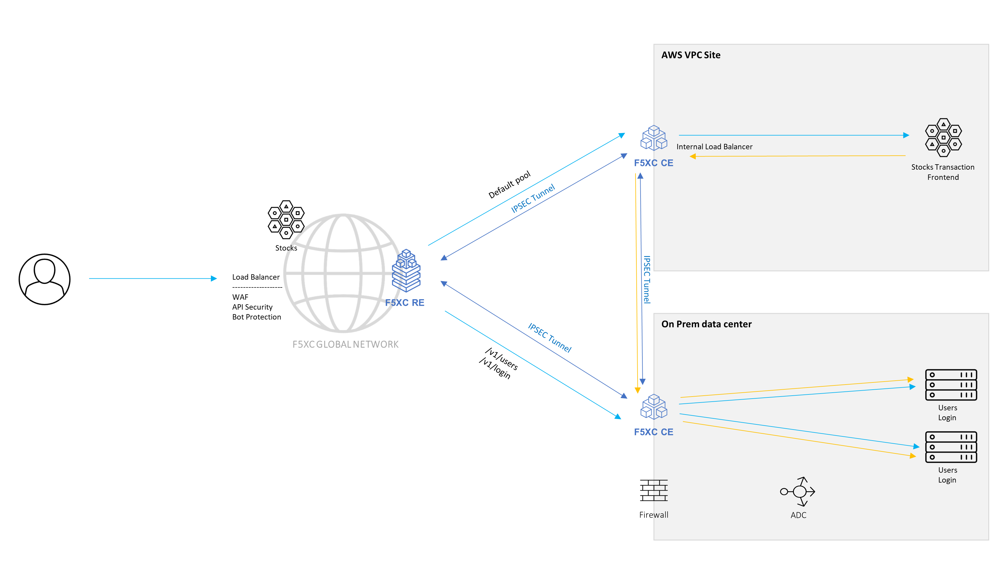

Class 3 - Virtual Kubernetes
############################

Lab Maintainers:

  Matthieu Dierick <m.dierick@f5.com>

  Sorin Boiangiu <s.boiangiu@f5.com>   

|

Welcome to the Virtual Kubernetes F5 XC class.

If you have reached this stage after finishing **Class 2** you can simply continue if not go to the **1 Click** sections of **Class 1** and **Class 2** and run throught the 1 Click configuration.

For this lab, we will use the **Arcadia Crypto** application.

This application is a modern application simulating a crypto trading platform app where you can buy and sell crypto currency.

The following components are used within the application:

* **Frontend** - serves the non dynamic content for like html, js, css and images
* **Login** - in in charge of dealing with anything related to the login user functionality
* **Users** - all user data interaction is done through this microservice only
* **Stocks** - connects to external resources to get the latest crypto data and serves it to the application clients
* **Stocks Transaction** - Deal with all related to buying or selling crypto currencies. It interact with other microservices like Users and Stocks
* **Database** - Database were all information is stored

F5 XC can provide a distributed Virtual Kubernetes environment where we can deploy our application containers in any of the F5 XC Regional Edges or Customer Edges.

This allows us to run our application code very close to the client and provide very fast responses.

During this class we will:

* Explore the F5 XC Virtual Kubernetes capabilities

.. note:: Before you procced to the lab it is mandatory to enter the email that you have joined the UDF with in order to populate any dynamic content. If all good the button will turn green.

.. raw:: html

    

        <label>Email:  
            <input type="text" id="email" oninput="processEmail()" />
        </label>
        <button id="getDataBtn" onclick="saveAndLoad()">Get Data</button>        
          
    

    

    

    </script>

    

.. toctree::
   :maxdepth: 2
   :glob:

   module*/module*