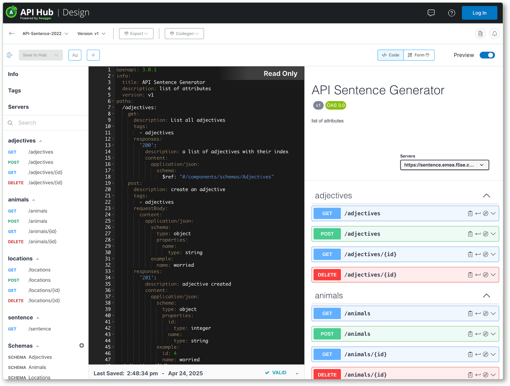
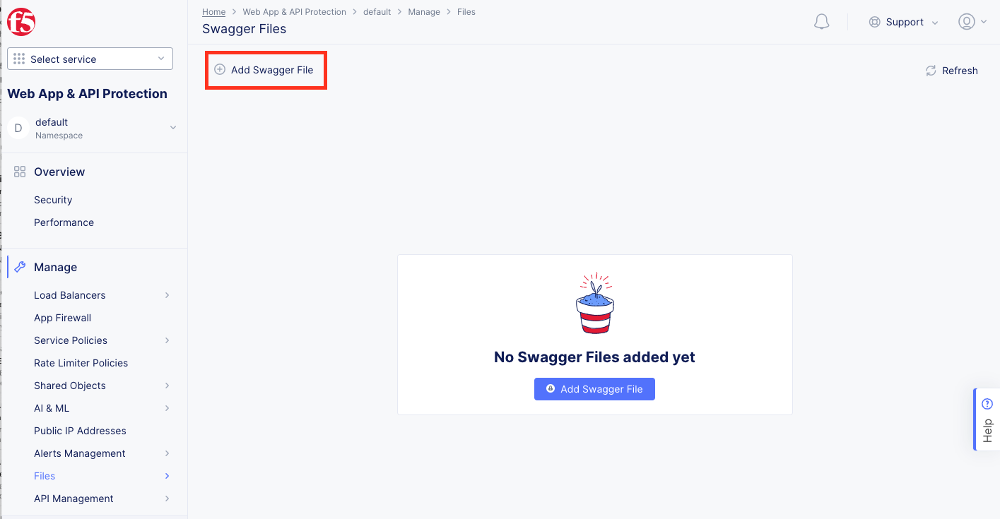
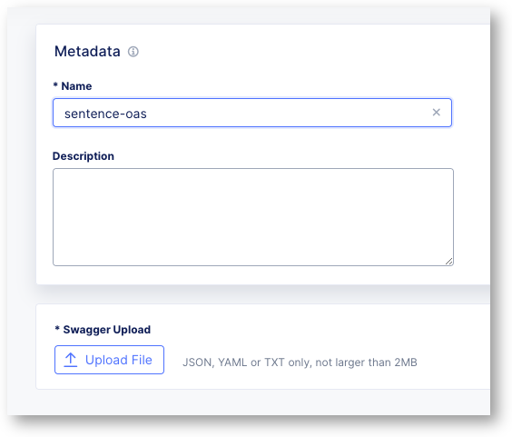
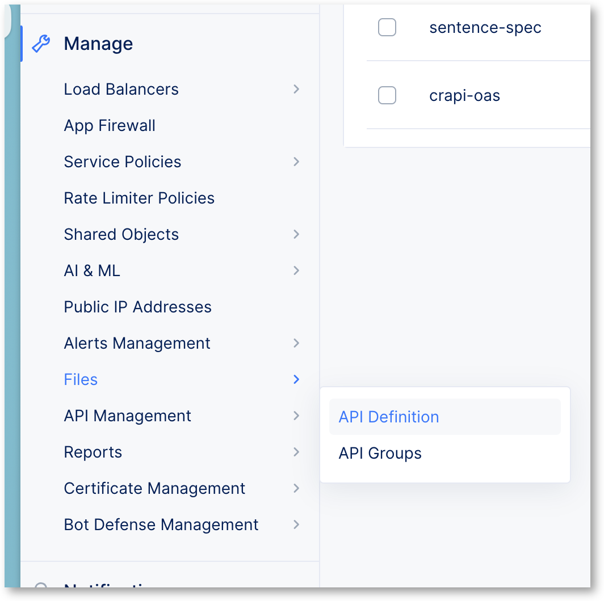
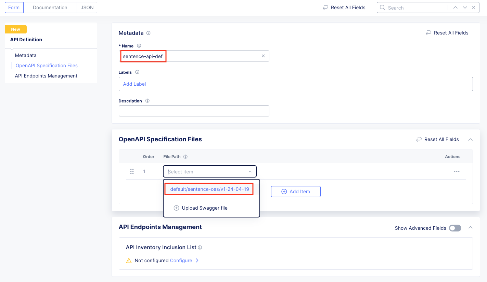
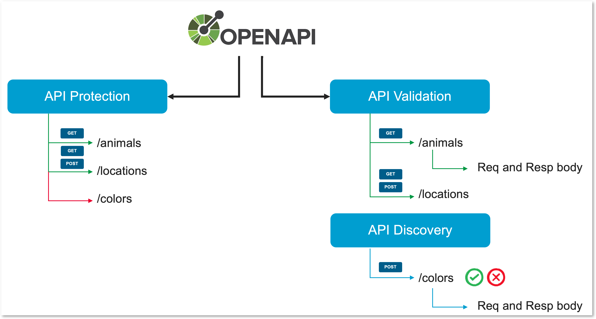

Protect the modern API application with F5XC - static protection
================================================================

Assign OpenAPI spec file to the LB
----------------------------------

|

Download the file
^^^^^^^^^^^^^^^^^
Go to the link below and export the OpenAPI Spec file as **YAML unresolved** file. It defines the Sentence API app **without** the COLORS API endpoint.

https://app.swaggerhub.com/apis/F5EMEASSA/API-Sentence-2022/v1-auth#/

|

Upload the file
^^^^^^^^^^^^^^^
**In your Namespace**, goto ``Web and API Protection`` > ``Manage`` > ``Files`` > ``Swagger Files`` and click  ``Add Swagger File`` on the top. The ``Add Swagger File`` button in the middle may not work currently due to a GUI bug. 

|

Create the API Definition
^^^^^^^^^^^^^^^^^^^^^^^^^
You can't assign an OAS spec file to a Load Balancer or a listener (Virtual Server in BIG-IP, Server or Location in Nginx). You must create an API Definition object.
In your Namespace, create a new API Definition into ``Web and API Protection`` > ``Manage`` > ``API Management`` > ``API Definition``

Create a new API Definition and select the file you just created in the step before. Select the version (so far, we have only one version) as shown in the screenshot below and click on ``Save and Exit``.

.. note:: The API Definition is now created, and can be assigned to a Load Balancer

Assign the API definition to the LB
^^^^^^^^^^^^^^^^^^^^^^^^^^^^^^^^^^^
1. Edit the Load Balancer created in the previous Lab (sentence-re-lb)
2. Go to the section ``API Protection``
3. Enable API Definition and select the API Definition you just created in the step before. Keep the validation ``Disabled`` at the moment and click on click on ``Save and Exit``.

   .. image:: ../pictures/api-protection.png
      :align: center
      :scale: 70%

Apply API Protection rules
--------------------------

Understand the difference between API Protection and API Validation
^^^^^^^^^^^^^^^^^^^^^^^^^^^^^^^^^^^^^^^^^^^^^^^^^^^^^^^^^^^^^^^^^^^

Before enforcing any policy, it is important to understand the differences between ``API Protection`` and ``API Validation`` (+API Discovery)

In the slide below, you can understand the difference:

* API Protection only allow ``known API endpoints and methods`` and does not enforce responses.
   * API Protection is ``Failed-Close`` by design

* API Validation ``validates`` the OpenAPI Spec file with methods, endpoints and parameters. It validates also the responses.
   * API Validation is ``Failed-Open`` by design

* API Discovery is on top of ``API Validation`` and will disovery unknown specifications (methods, endpoints and parameters)
   * API Discovery can be used alone without API Validation if API Dev can't deliver with OAS file.

Create the default API Protection rule
^^^^^^^^^^^^^^^^^^^^^^^^^^^^^^^^^^^^^^

In this lab, we will create an ``API Protection rule`` to enforce and only allow ``known specifications``. The endpoints defined in the OAS files are:

* /adjectives
* /animals
* /locations

As a reminder, the endpoint ``/colors`` is not defined in the specification file, and the base path is ``/api/``

#. Edit your Sentence Application LB
#. In ``API Protection rules`` , create a new rule

   .. image:: ../pictures/api-protection-rule1.png
      :align: center
      :scale: 70%

#. Create 2 rules in ``Server URLs and API Groups``
  
   #. Rule 1: allows the methods and endpoints defined in the OAS file.

      .. image:: ../pictures/allow-all-rule.png
         :align: left
         :scale: 50%

   #. Rule 2: deny the rest

      .. image:: ../pictures/deny-unknown.png
         :align: left
         :scale: 50%

#. You should now have 2 rules. Save all your configurations.

   .. image:: ../pictures/all-rules.png
      :align: center
      :scale: 50%

#. Save and Exit.

.. note:: You are good to test your first API Protection Load Balancer in F5 Distributes Cloud