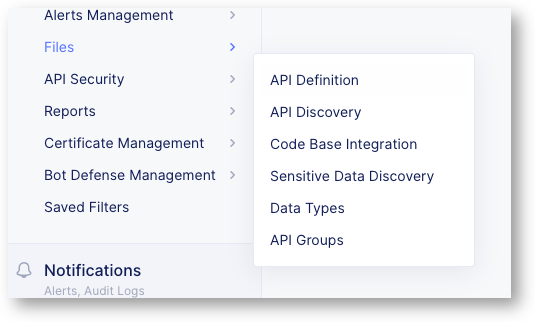

Start Protecting the modern API application with F5XC
=====================================================

Assign OpenAPI spec file to the LB
----------------------------------

|

Copy Paste the SWAGGER File
^^^^^^^^^^^^^^^^^^^^^^^^^^^
Go to the link below and copy the OpenAPI Spec file on your laptop with extension .yaml. It defines the Sentence API app **without** the COLORS API endpoint.

https://app.swaggerhub.com/apis/F5EMEASSA/API-Sentence-2022/v1-auth

.. image:: ../pictures/swaggerhub.png
   :align: left

|

Upload the file
^^^^^^^^^^^^^^^
**In your Namespace**, goto ``Web and API Protection`` > ``Manage`` > ``Files`` > ``OpenAPI Files`` and click  ``Add OpenAPI Files`` on the top. The ``OpenAPI Files`` button in the middle may not work currently due to a GUI bug. 

.. image:: ../pictures/add-swagger.png
   :align: left

|

.. image:: ../pictures/add-oas.png
   :align: left

Create the API Definition
^^^^^^^^^^^^^^^^^^^^^^^^^
You can't assign an OAS spec file to a Load Balancer or a listener (Virtual Server in BIG-IP, Server or Location in Nginx). You must create an API Definition object.
In your Namespace, create a new API Definition into ``Web and API Protection`` > ``Manage`` > ``API Security`` > ``API Definition``

Create a new API Definition and select the file you just created in the step before. Select the version (so far, we have only one version) as shown in the screenshot below and click on ``Save and Exit``.

.. image:: ../pictures/create-api-def.png
   :align: left

.. note:: The API Definition is now created, and can be assigned to a Load Balancer

Assign the API definition to the LB
^^^^^^^^^^^^^^^^^^^^^^^^^^^^^^^^^^^
1. Edit the Load Balancer created in the previous Lab (sentence-re-lb)
2. Go to the section ``API Protection``
3. Enable API Definition and select the API Definition you just created in the step before. Keep the validation ``Disabled``.
4. Click on ``Save and Exit``

   .. image:: ../pictures/api-protection.png
      :align: center
      :scale: 70%
