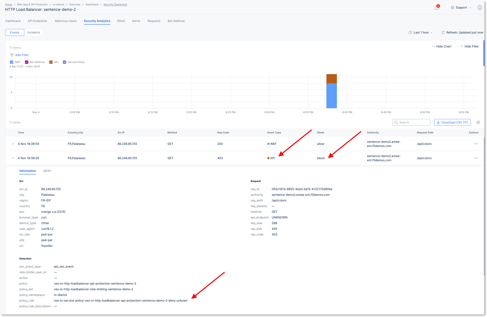

Test your modern API application protection
===========================================

#. If you have curl on your machine, go to the next step. Else, connect with SSH or WEBSSH to the Jumphost machine
#. Run the below calls

   .. code-block:: none

      curl -H "Content-Type: application/json;charset=UTF-8" http://sentence-re-$$makeId$$.workshop.emea.f5se.com/api/adjectives

   .. code-block:: none

      curl -H "Content-Type: application/json;charset=UTF-8" http://sentence-re-$$makeId$$.workshop.emea.f5se.com/api/animals

   .. code-block:: none

      curl -H "Content-Type: application/json;charset=UTF-8" http://sentence-re-$$makeId$$.workshop.emea.f5se.com/api/locations

   .. note:: The 3 calls are successful because there are defined in the OAS file (method + endpoint)

#. Now, run the below call

   .. code-block:: none

      curl -H "Content-Type: application/json;charset=UTF-8" http://sentence-re-$$makeId$$.workshop.emea.f5se.com/api/colors

   .. note:: This call is denied because not part of the OAS file

Check the logs
--------------

* Go tho the security dashboard (Overview > Dashboards > Security Dashboard)
* Scroll down and click on your ``sentence`` app LB
* Go to ``Security Analytics``

.. note:: Scroll and search for API events

