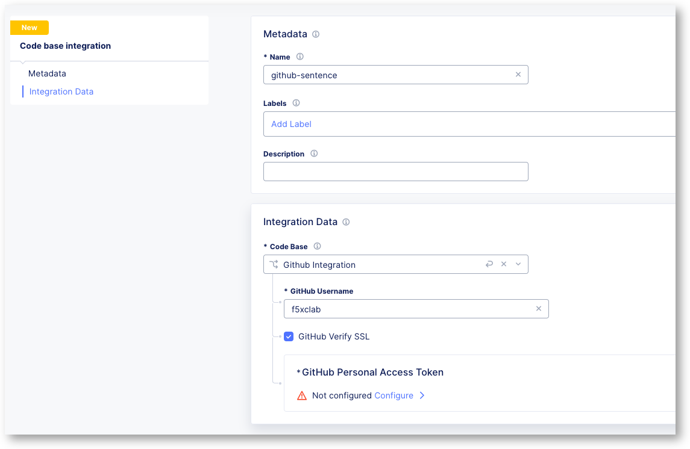

Enable API code scanning discovery (under construction)
=======================================================

F5 solutions can detect and protect APIs during the full API develoment lifecycle which includes also to learn API endpoints and further information to e.g. build the schema from the source code the developers create and maintain on the code repository.

We use the "Sentence application" source code for this lab which is available at the public Github repository: https://github.com/ca-scans/sentence-source-code-v2

.. note:: There is also a video and a FAQ avilable for F5 employees
* FAQ -  XC API code scan FAQ.docx (sharepoint.com)
* Video – API discovery from code.mp4 (sharepoint.com)
  on the internal ) For the TechXchange 2024 - Please use this `Teams chat <https://teams.microsoft.com/l/channel/19%3Aca3de856a85c47b1809f9803723c45d2%40thread.tacv2/XC%20API%20Security%20Lab%20Support?groupId=100b8a10-f3d0-4d73-bc24-c463f941d064&tenantId=dd3dfd2f-6a3b-40d1-9be0-bf8327d81c50>`_ if you have any issues, questions or feedback for the XC API security lab

Enable Code Base Integration
----------------------------

* Goto Web App & API Protection > API Management > Code Base Ingration
* Add a new code base integration profile

  * Name: ``github-sentence``
  * Code base: ``Github Integration``
  * Github Name: ``f5xclab``
  * GitHub Personal Access Token: paste and blindfold below Token

  .. code-block:: bash
    
    sdlkjflksdjglkdfshglkjdflgjldksfgjlksd

* Save
