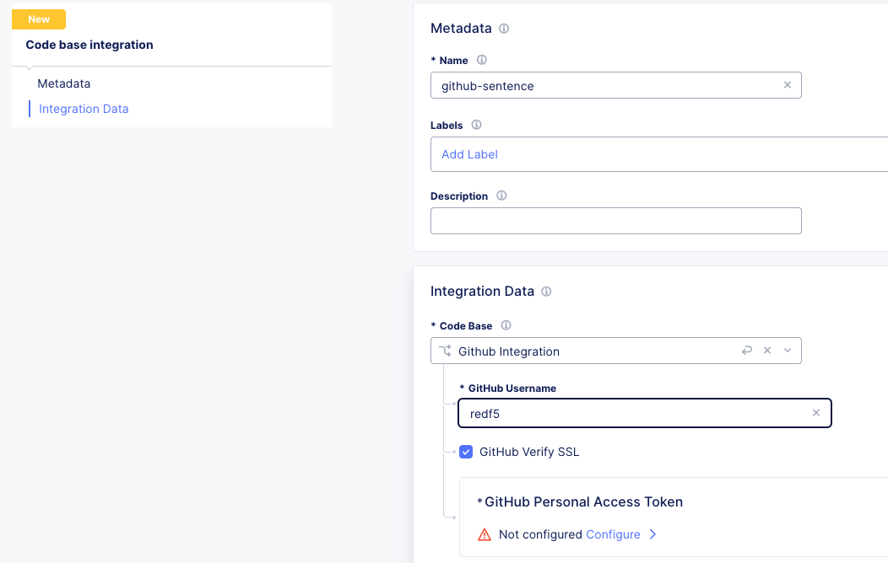

Enable API code scanning discovery (under construction)
=======================================================

F5 solutions can detect and protect APIs during the full API develoment lifecycle which includes also to learn API endpoints and further information to e.g. build the schema from the source code the developers create and maintain on the code repository.

We use the "Sentence application" source code for this lab which is available at the public Github repository: https://github.com/ca-scans/sentence-source-code-v2

.. note:: There is also a video and a FAQ available for F5 employees

 * FAQ -  XC API code scan `FAQ <https://f5.sharepoint.com/sites/SalesCoP/SitePages/XC-API-code-scan-FAQ.aspx>`_
 *  * Video – API discovery from `code <https://f5.sharepoint.com/sites/SalesCoP/SitePages/API-discovery-from-code---introduction-video.aspx>`_

Enable Code Base Integration
----------------------------

* Goto Web App & API Protection > API Management > Code Base Ingration
* Add a new "Code Base Integration" with the following values

  * Name: ``github-sentence``
  * Code base: ``Github Integration``
  * Github UserName: ``redf5``
  * GitHub Personal Access Token: copy and paste the classic token below to Blindfold

  .. code-block:: bash

    1234

|

.. image:: ../pictures/c123.png
   :align: left

* Click Apply and Save and Exit
* Go to settings and change it as shown in the screenshot to show further information. The Health status should change from "INITIALIZING" to "CONNECTED".

.. image:: ../pictures/code-base- integration- initializing-and-show-settings.png
   :align: left

|

* XC is going to scan the code, so give it some time until you see further updates on e.g. the "Number of API Repositories"  

.. image:: ../code-base-integration-connected-connected.png
   :align: left

|

Assign the Code Base Integration to the Load Balancer
-----------------------------------------------------

* Edit your Load Balancer, go to the API Protection and enable API Discovery (keep the default settings)

.. image:: ../code-base-integration-connected-connected.png
   :align: left

* In the same configuration screen, look for API repositories and click on Configure

.. image:: ../code-base-integration-connected-connected.png
   :align: left