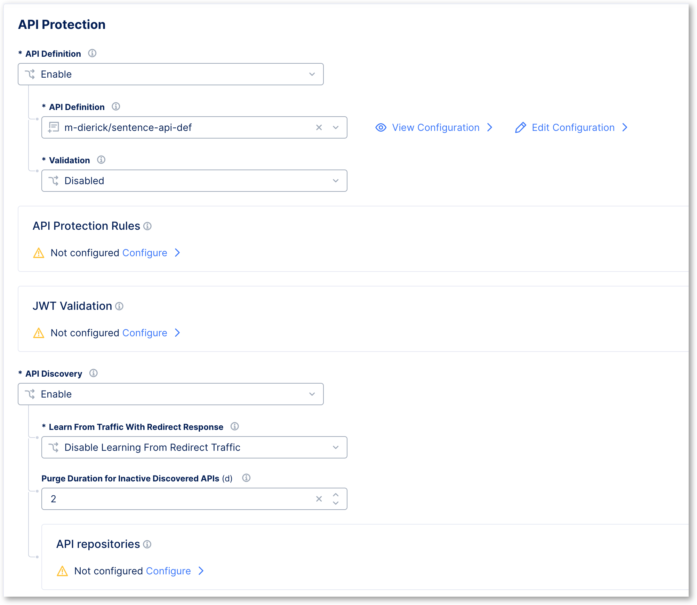
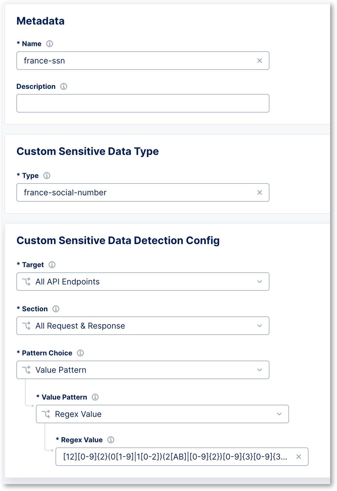
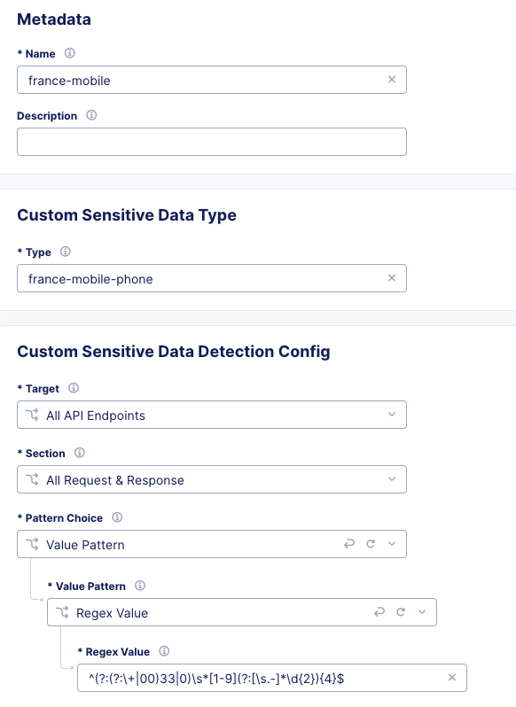
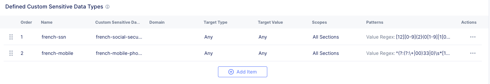

Enable API discovery
====================

In the previous section, we enabled ``API Validation`` in order to enforce protection on ``what we know`` from the OpenAPI Spec file.
But we kept the ``Fall Through Mode`` to ``Allow`` so that we do not break the application or impact business down when DevOps push a new version of the API, but SecOps are not ready or up to date.

The ``API Discovery`` will provide visility for SecOps in order to see this ``Drift``. This Drift is the difference between ``what we know`` and ``what we see / what is consumed``

.. image:: ../pictures/slide-api-discovery.png
   :align: center
   :scale: 40%

Enable Endpoint Discovery
-------------------------

* Edit your Load Balancer again, go to API Protection and enable ``API Discovery`` (keep the default settings)

Enable PII Discovery
--------------------

OWASP Top10 API requires to detect and discover sensitive datas in Requests and Responses. F5 Distributed Cloud supports this and provides a predefined list of known PII (Personal Identifiable Information), such as:

* email
* credit card number
* US Social Security Number
* IP address

But you want to detect your own PII, such as:

* Country Social Security Number
* Mobile Phone Number
* Etc ...

Create custom PII
^^^^^^^^^^^^^^^^^

* In Sensitive Data Detection, click on ``configure``.
* Add two new ``Defined Custom Sensitive Data Types``, enable detection for ``All Endpoint, Request and Response, Value Pattern``

  * For France/French SSN, use this regex ``[12][0-9]{2}(0[1-9]|1[0-2])(2[AB]|[0-9]{2})[0-9]{3}[0-9]{3}([0-9]{2})``
  
  * For France/French Mobile Phone, use this regex ``^(?:(?:\+|00)33|0)\s*[1-9](?:[\s.-]*\d{2}){4}$``

|

   
|

   
|

* SAVE your Load Balancer changes

Run the traffic generator script
--------------------------------

It is time to run a traffic generator script to populate the logs and the AI/ML engines.

* SSH or WEBSSH to the Jumphost
* Run this script into /home/ubuntu/api-protection-lab folder

.. code-block:: none

   cd /home/ubuntu/api-protection-lab
   bash api-all.sh sentence-re-$$makeId$$.workshop.emea.f5se.com

