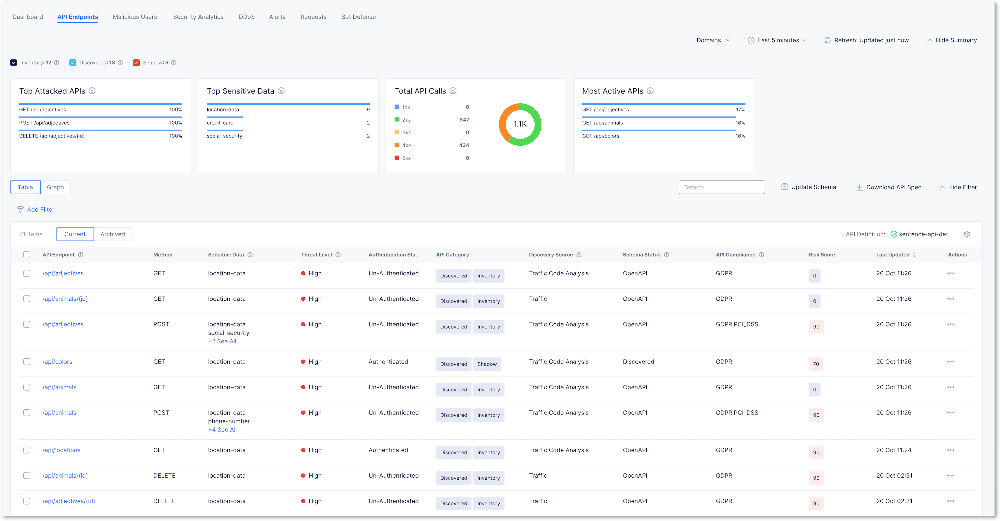
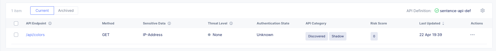
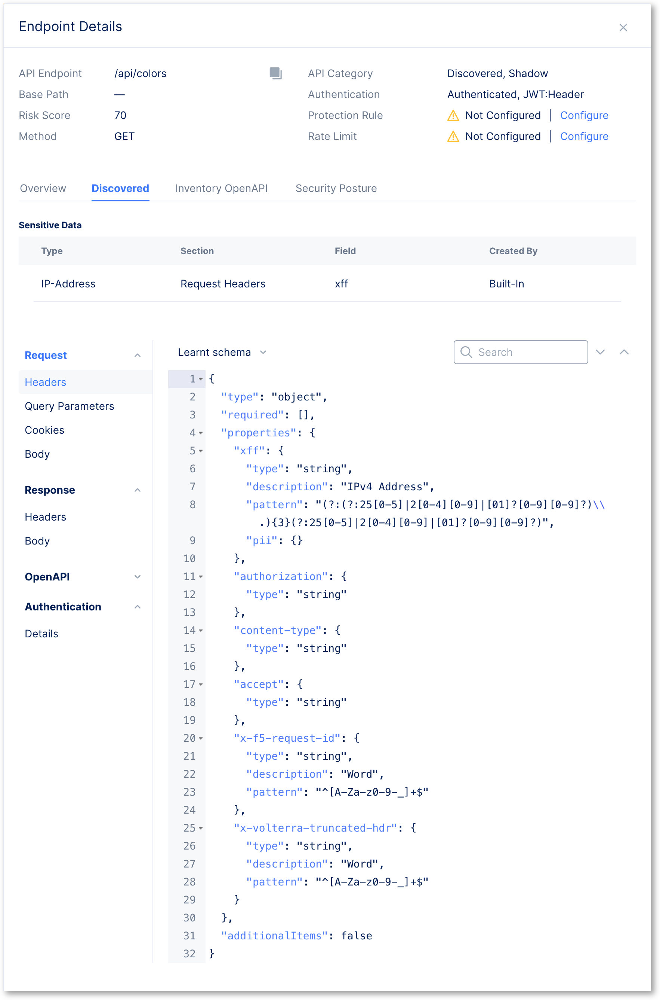
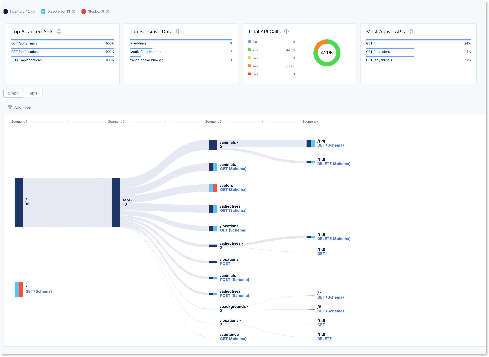
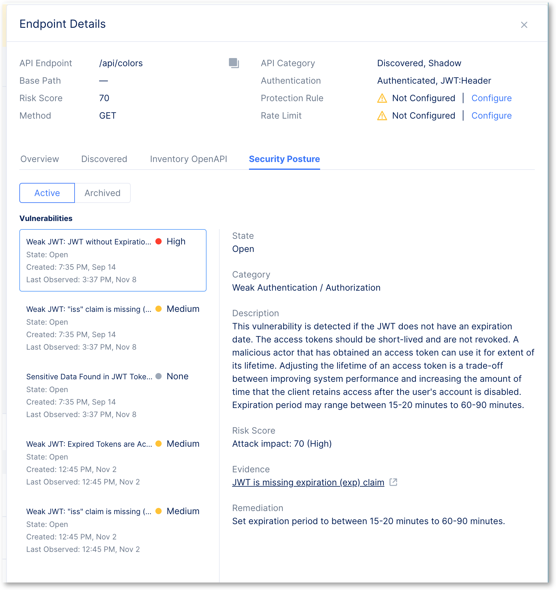

API Discovery outcomes
======================

At the first stage, API Discovery process requires several hours to collect datas and make them visible. Don't be surprised if you must wait 2 hours to see the first datas.

But in this lab, the instructor has ``super powers`` and can force the discovery. This won't be the case for the TechXchange CY24 because every SE can make the lab whenever they want the week before the TechXchange.

Endpoint Discovery
------------------

* Goto Web App & API Protection > Overview > Security > Dashboard
* Click on your Application Load Balancer
* Click on ``API Endpoints`` to see the endpoints in the the "Table" view.

Understand the API Discovery elements
^^^^^^^^^^^^^^^^^^^^^^^^^^^^^^^^^^^^^

On the top left corner, there are 3 important elements:

* **Inventory** : Endpoints known by the OpenAPI Spec file

  * In our lab, there are 3 endpoints know (adjectives, animals, locations)

* **Discovered** : What the F5 XC platform is sees from traffic (Known and Unknown endpoints)
* **Shadow** : What is ``Discovered`` but **NOT PART** of the ``Inventory``

You can filter on ``Shadow`` only for instance. You can see the ``/colors`` as a Shadow API.

Go deeper into the discovery
^^^^^^^^^^^^^^^^^^^^^^^^^^^^

* Click on the ``/colors`` shadow API endpoint. A pop-up will appear on the right side of the screen.
* You can see on the top right corner, 2 actions

  * **API Protection rule** : if you want to block this endpoint. Let's say SecOps have this power to block unknown endpoints.

  * **Rate Limiting** : if you want to Rate Limit this endpoint because SecOps don't have the full power and don't want to break the app.

* Click on the ``Discovered`` tab and navigate into the sub-menus. You will see all the details discovered by the platform.

PII Discovery
-------------

* Click on the ``/animals`` API endpoint. A pop-up will appear on the right side of the screen.

  .. image:: ../pictures/pii-1.png
     :align: left
     :scale: 50%

* Click on the ``Discovered`` tab to show discovered sensitive data for requests and responses.

  .. image:: ../pictures/pii-2.png
     :align: left
     :scale: 50%

.. warning:: Dataguard can obfuscate sensitive PII data in the response but currently not for custom created PII configurations. This feature is in the roadmap. OWASP Top 10 does not require to ``hide`` sensitive data.

Click on the ``Graph`` tab to show the API endpoints in a different view.

 
Authentication Discovery
------------------------

* Click on an endpoint with an ``Authenticated`` state, like **/api/locations**

  .. image:: ../pictures/authenticated-endpoint.png
     :align: left
     :scale: 50%

* Click on ``Discovered`` tab and check the Authentication details

  .. image:: ../pictures/auth-discovery.png
     :align: left
     :scale: 50%

* Notice that the auth information collected from the OpenAPI Spec file differs from the discovered auth information. If both don't match, a "Security Posture" is raised.

  .. image:: ../pictures/basic-auth.png
     :align: left
     :scale: 50%

AI/ML Security Posture
----------------------

* Click on an endpoint with the highest ``Risk Score``
* And click on the ``Security Posture`` tab
* Review the recommandations done by AI/ML engines

* Click on the ``Evidence`` link to get more details about the logs who generated this security posture.

.. note:: Congratulation, your application is now protected by a modern engine enforcing (validating) what is provided by the developers, but also providing visibility for unkown traffic.