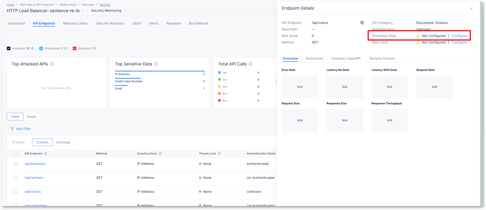

API Inventory Management
========================

API Inventory Management is a feature designed to enhance your API ecosystem by simplifying the management of your API inventory. 

It allows easy management of discovered APIs, marking of non-API discoveries, removal of outdated endpoints, and seamless updates for API schemas. 
This tool keeps your API inventory organized, current, and secure, catering to your dynamic requirements.

Add Shadow API into the Inventory
---------------------------------

In the previous lab, we discoverd /api/colors as a ``shadow API``. DevOps already opened a ServiceNow ticket with SecOps to provide the new OpenAPI Spec file including /colors.
But SecOps are late in their ticketing queue, and they haven't seen this ticket yet but they must take a decision about this endpoint.

SecOps can block the request with an API Protection rule. We covered how to create it in the ``Static API Protection`` lab. FYI, there is a shortcut directly into the API EndPoint screen as shown in the screenshot below.
**Don't block it now, it is a legitimate endpoint.**

We will not block it, SecOps had the information from a side channel this endpoint is part of the application update from yesterday night.

We need to add this endpoint into the inventory (the OpenAPI Spec), but we will not update the Spec File as the source of truth are the DevOps. Instead, we will add the endpoint into the ``Inclusion List``.

.. note:: Inventory = OpenAPI File + Inclusion List

Add Colors shadow API into the Inventory (inclusion list)
^^^^^^^^^^^^^^^^^^^^^^^^^^^^^^^^^^^^^^^^^^^^^^^^^^^^^^^^^

* Click on the dot (...) at the right of the /api/colors endpoint

* Click on ``Move to Inventory``

  .. image:: ../pictures/move-to-inventory.png
     :align: left
     :scale: 50%

* A warning message will confirm the add

  .. image:: ../pictures/warning-inventory.png
     :align: left
     :scale: 50%

* Click ``Move to Inventory``

* Now, you can see ``/api/colors`` is not a Shadow API anymore. It is part of Inventory.

  .. image:: ../pictures/moved-inventory.png
     :align: left
     :scale: 50%

How to find all endpoints added into the Inventory (Inclusion List) ?
^^^^^^^^^^^^^^^^^^^^^^^^^^^^^^^^^^^^^^^^^^^^^^^^^^^^^^^^^^^^^^^^^^^^^

As mentioned before, API endpoints are not added into the OAS Spec file because this file is maintenained by AppDev/DevOps. Instead, we create an ``Inventory Inclusion List``

* Go to API Management > Edit your API Definition

* You can see an API Inventory Inclusion List

  .. image:: ../pictures/oas-inclusion-list.png
     :align: left
     :scale: 50%

* Click on ``Edit Configuration`` to see the content

  .. image:: ../pictures/inclusion-list.png
     :align: left
     :scale: 50%

.. note:: When AppDev/DevOps will push a new version of the OpenAPI Spec file to F5 XC, a new version of the file will be available for the SecOps. SecOps will update the definition with this new file (let's say v2)
    If this version includes ``/api/colors``, the entry into the Inventory Inclusion List will not be taken into account. The OAS Spec file specified on F5 XC takes precedence over Inventory Inclusion List.

