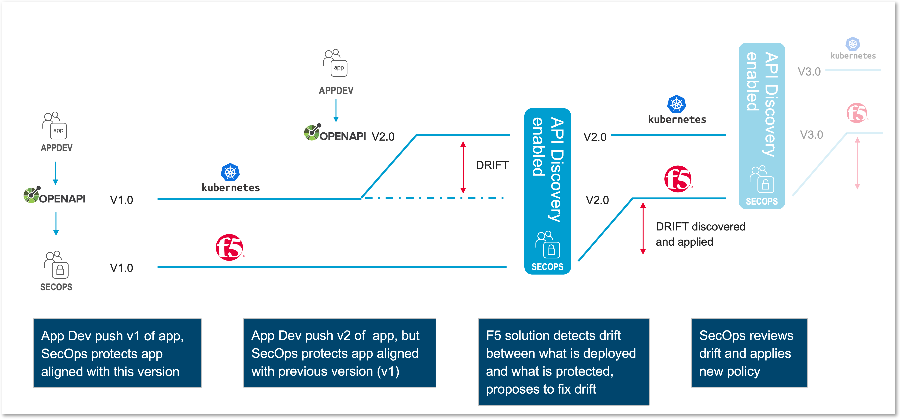
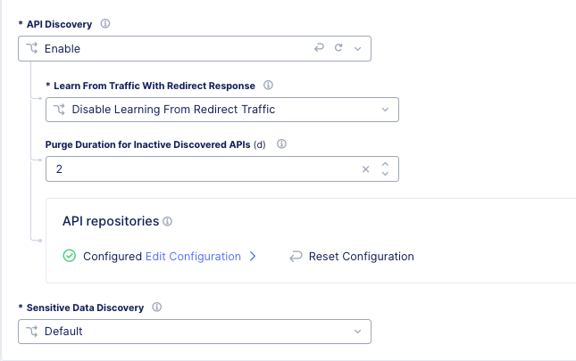

Enable API traffic discovery
============================

In the previous section, we enabled ``API Validation`` in order to enforce protection on ``what we know`` from the OpenAPI Spec file.
But we kept the ``Fall Through Mode`` to ``Allow`` so that we do not break the application or impact business down when DevOps push a new version of the API, but SecOps are not ready or up to date.

The ``API Discovery`` will provide visility for SecOps in order to see this ``Drift``. This Drift is the difference between ``what we know`` and ``what we see / what is consumed``

But OWASP Top10 requires also to provide visibility on PII (Personal Identifiable Information) in order to avoid Data Leakage. To do so, we will enable ``Sensitive Data Disvovery``

Enable API Endpoint Discovery
-----------------------------

* If you skipped the lab2 "Enable Code Scanning Discovery, edit your Load Balancer again, go to API Protection and enable ``API Discovery`` (keep the default settings)

Enable Sensitive Data Discovery
-------------------------------

OWASP Top10 API requires to detect and discover sensitive datas in Requests and Responses. F5 Distributed Cloud supports this and provides a predefined list (+400) of known PII (Personal Identifiable Information), such as:

* email
* credit card number
* US Social Security Number
* IP address

.. note:: By default, a list is already assigned to the Load Balancer

  .. image:: ../pictures/default-pii-setting.png
     :align: left
     :scale: 50%

But if you want to detect your own PII, such as:

* Country Social Security Number
* Mobile Phone Number
* Etc ...

You must create your own patterns.

Create custom Sensitive Data Discovery
^^^^^^^^^^^^^^^^^^^^^^^^^^^^^^^^^^^^^^

* In Sensitive Data Discovery, select ``Custom``
* Add a new item

  * Give a name: custom-frenchies
  * Select the Compliance Frameworks required for this API Application. We select ``PCI-DSS`` ``GDPR`` 

.. note:: By selecting PCI-DSS and GDPR, all data patterns classified as PCI-DSS and GDPR will be added.

* But now, we want to add custom patterns to detect frenchy sensitive datas
* Configure ``Defined Custom Sensitive Data Types``, and add 2 items

  * Name: ``france-ssn``
  
    * Data Type Rules: 
  
      * Value Pattern
      * Regex Value : ``[12][0-9]{2}(0[1-9]|1[0-2])(2[AB]|[0-9]{2})[0-9]{3}[0-9]{3}([0-9]{2})``

    * Mark as Sensitive Data
    * Mark as PII
    * Relevant Compliance: ``GDPR``

    .. image:: ../pictures/pii-ssn.png
       :align: left
       :scale: 50%

  * Name: ``france-mobile-phone``
  
    * Data Type Rules: 
  
      * Value Pattern
      * Regex Value : ``^(?:(?:\+|00)33|0)\s*[1-9](?:[\s.-]*\d{2}){4}$``

    * Mark as Sensitive Data
    * Mark as PII
    * Relevant Compliance: ``GDPR``

* Apply and Save your LB config

Run the traffic generator script
--------------------------------

It is time to run a traffic generator script to populate the logs and the AI/ML engines.

* SSH or WEBSSH to the Jumphost
* Run this script into /home/ubuntu/api-protection-lab folder

.. code-block:: none

   cd /home/ubuntu/api-protection-lab
   bash api-all.sh sentence-re-$$makeId$$.workshop.emea.f5se.com

.. note:: 

  Please tell your instructor you reached this point.