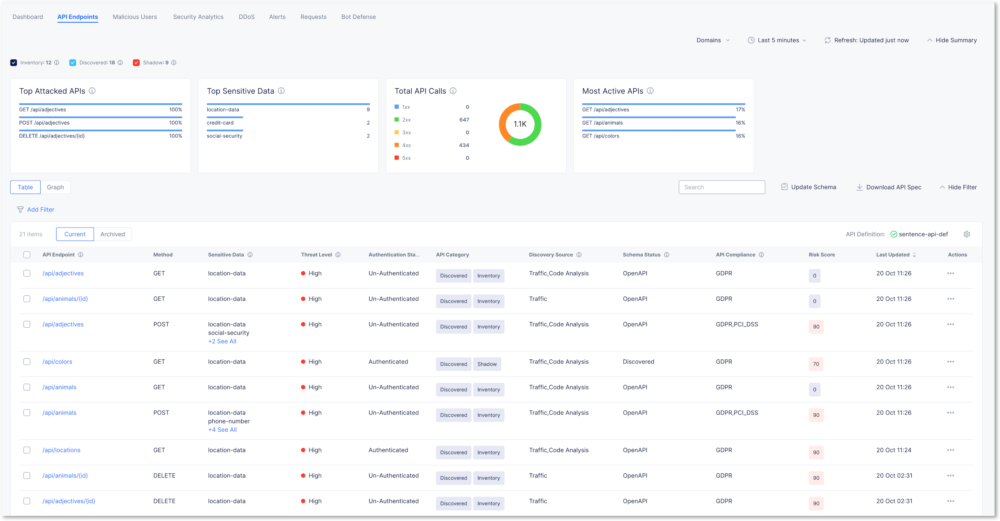

API Discovery outcomes
======================

.. note:: The "code base and traffic discovery" scheduler runs on a random interval within a two hours time window and therefore it can take up to 2 hours (maximum) to see all results in the Dashboard for the "API Discovery outcomes" lab section. You can also continue with the next lab "Advanced Protection - "JWT validation and access control" (module 3) and continue here later.

.. note:: The code base "repo discovery" is done once a day

Endpoint Discovery
------------------

* Goto Web App & API Protection > Overview > Security > Dashboard
* Click on your Application Load Balancer
* Click on ``API Endpoints`` to see the endpoints in the the "Table" view.

Understand the API Discovery elements
^^^^^^^^^^^^^^^^^^^^^^^^^^^^^^^^^^^^^

API Category
************

On the top left corner, there are 3 important elements:

* **Inventory** : Endpoints known from the OpenAPI Spec file

  * In our lab, there are 3 endpoints know (adjectives, animals, locations)

* **Discovered** : Endpoints that the XC platform has discovered/learned from live traffic (known and unknown endpoints)
* **Shadow** : Endpoints that have been ``Discovered`` but are **NOT PART** of the ``Inventory``

You can filter on ``Shadow`` only to show the ``/colors`` endpoint as a Shadow API.

.. image:: ../pictures/shadow.png
   :align: left
   :scale: 50%

Discovery Source and Schema Status
**********************************

The ``Discovery Source`` tells you from which source each EndPoint has been discovered

* Traffic: discovered thanks to traffic passing through XC (real traffic)
* Code Analysis: discovered by scanning the source code into the repositories

The ``Schema status`` tells you if this Endpoint is part of the OpenAPI specification file

.. note:: These 2 columns are very important. First of all, this shows if the Endpoint is part of the source code. Then, it shows if this Endpoint is exposed (traffic) and also part of the OpenAPI specification file. The best outcome is when an Endpoint is part of Code Base and Traffic discovery and also in OpenAPI Spec file.

Go deeper into the discovery
^^^^^^^^^^^^^^^^^^^^^^^^^^^^

* Click on the ``/colors`` shadow API endpoint. A pop-up will appear on the right side of the screen.
* You can see on the top right corner, 2 actions

  * **API Protection rule** : if you want to block this endpoint. Let's say SecOps have this power to block unknown endpoints.

  * **Rate Limiting** : if you want to Rate Limit this endpoint because SecOps don't have the full power and don't want to break the app.

* Click on the ``Discovered`` tab and navigate into the sub-menus. You will see all the details discovered by the platform.

.. image:: ../pictures/discovered.png
   :align: left
   :scale: 50%

Sensitive Data Discovery
------------------------

* Click on the ``/animals`` API endpoint. A pop-up will appear on the right side of the screen.

  .. image:: ../pictures/pii-1.png
     :align: left
     :scale: 50%

* Click on the ``Discovered`` tab to show discovered sensitive data for requests and responses.

  .. image:: ../pictures/pii-2.png
     :align: left
     :scale: 50%

.. warning:: Dataguard can obfuscate sensitive PII data in the response but currently not for custom created PII configurations. This feature is in the roadmap. OWASP Top 10 does not require to ``hide`` sensitive data.

Click on the ``Graph`` tab to show the API endpoints in a different view.

.. image:: ../pictures/octopus.png
   :align: left
   :scale: 50%

 
Authentication Discovery
------------------------

* Click on an endpoint with an ``Authenticated`` state, like **/api/locations**

  .. image:: ../pictures/authenticated-endpoint.png
     :align: left
     :scale: 50%

* Click on ``Discovered`` tab and check the Authentication details

  .. image:: ../pictures/auth-discovery-new.png
     :align: left
     :scale: 50%

* Notice that the auth information collected from the OpenAPI Spec file differs from the discovered auth information. If both don't match, a "Security Posture" is raised.

  .. image:: ../pictures/basic-auth.png
     :align: left
     :scale: 50%

AI/ML Security Posture
----------------------

* Click on an endpoint with the highest ``Risk Score``
* And click on the ``Security Posture`` tab
* Review the recommandations done by the AI/ML engine

.. image:: ../pictures/security-posture.png
   :align: left
   :scale: 50%

* Click on the ``Evidence`` link to get more details about the logs who generated this security posture.

.. note:: Congratulation, your application is now protected by a modern engine enforcing (validating) what is provided by the developers, but also providing visibility for unkown traffic.

Compliance
----------

The last information provided by F5XC is the ``compliance``. In lab ``Enable API traffic discovery`` we created 2 custom Sensitive Data (called Data Type)

* The ``French Social Security Number``
* The ``French Phone Number``

To each, we assigned a compliance ``GDPR``. But the F5XC platform has +400 data types into its database. Each data type has one or more compliance assigned.
For instance, the ``payment-details`` data type is defined as below. You can find it into API Management > Data Types

.. code-block:: json
   :emphasize-lines: 24, 25

   "get_spec": {
    "rules": [
      {
        "key_pattern": {
          "exact_values": {
            "exact_values": [
              "payment_method",
              "pay_method",
              "payment_type",
              "payment_option",
              "payment_mode",
              "payType",
              "payment_source",
              "pay_method_type",
              "payment_service",
              "payment_system"
            ]
          }
        }
      }
    ],
    "is_sensitive_data": true,
    "is_pii": false,
    "compliances": [
      "PCI_DSS"
    ],

This data type has the PCI-DSS compliance assigned. It means, if such pattern is seen in the request or in the response for an API Endpoint, F5XC dashboard will categorize this endpoint as PCI-DSS compliance.

.. note:: This compliance is an ``information`` not an ``enforcement``. It shows to SecOps, for each Endpoint, the compliance to apply based on the sensitive datas detected. In our exmaple, the company must rely to PCI-DSS in order to be compliant as a sensitive data belonging to PCI-DSS has been discovered.