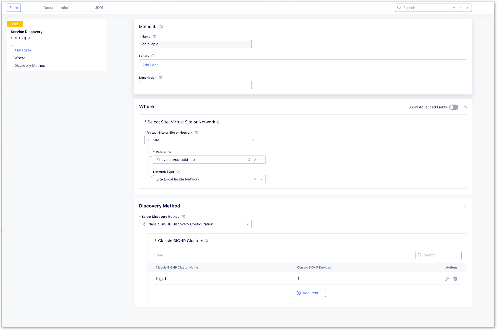
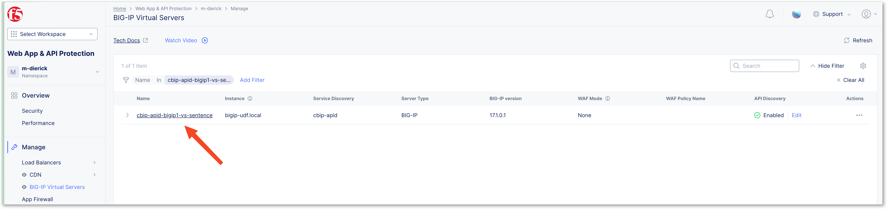

Enable API discovery for BIG-IP (under construction)
====================================================

In the previous lab, we learnt how F5 Distributed Cloud can discover API Endpoints when those endpoints are exposed on F5 Distributed Cloud infrastructure. 
But many modern applications (API firt) reside on-premises behind BIG-IP. In order to offer the same level of services, F5 deployed the on-premises API Discovery for BIG-IP.

In this lab, you will learn how to ``onboard`` a BIG-IP into F5XC, in order to enable the API Discovery feature on this BIG-IP.

Key take aways before jumping into the lab:

* Out of Band Discovery
* CE required on BIG-IP Network
* CE collects and anonymises logs from BIG-IP
* F5XC runs API Discovery engine in F5XC infrastructure
* Outcomes

  * Inventory
  * Security Insights risks
  * Compliance
  * Authentication state
  * Sensitive Data


Deploy Customer Edge (CE)
-------------------------

The CE (Customer Edge) is already deployed for you. You can find it into Multi-Cloud Network Connect > Overview > Infrastructure > Sites
The CE is deployed with 2 NICs

* NIC Outside in charge of IPSEC tunnels between CE and RE
* NIC Inside in charge of configuring BIG-IP and collect logs from BIG-IP

In a nutshell, F5XC will configure the BIG-IP to collect request logs from the Virtual Server, and send those logs to the CE. Then the CE will anonymize the logs and send them to the F5XC infrastructure to render the API Discovery endpoints and insights.


Onboard on-premises BIG-IP
--------------------------

The BIG-IP is already up and running into your lab environment. Each student has his own BIG-IP.

Go to Multi-Cloud App Connect tile > Manage > Service Discovery, and create a new Service Discovery type BIG-IP


Configure the service discovery so it can find the BIG-IP

* Select your CE under ``Reference``
* Select ``Site Local Inside Network`` under ``Network Type`` <- This is the interface on the BIG-IP Self-IP (but we could have used the mgmt interface)
* Click ``Add Item`` under ``Classic BIG-IP Clusters``

.. image:: ../pictures/create-service-discovery.png
   :align: left
   :scale: 50%

* Give a name to the BIG-IP such as ``bigip1``
* Click Add Item under ``Classic BIG-IP Devices``
* Configure with the BIG-IP settings
  
  * Management IP: ``10.1.20.8`` <- Self-IP address
  * Admin username: ``admin``
  * Admin password: ``admin``

* Apply

Your configuration should look like this



After few minutes, you can click on Refresh button, you should see ``1 services``. This service is the BIG-IP Virtual Server


.. note:: At this stage, the BIG-IP is onboarded in F5 Distributed Cloud and API Discovery can be enabled on this BIG-IP (from the F5XC Console) so that the BIG-IP sends traffic logs to F5XC.


Enable API Discovery on BIG-IP Virtual Server
---------------------------------------------

Click on the ``1 Services`` blue link to be redirected to the Multi-Cloud App Connect ``discovered services`` page where we will enable the different features on the BIG-IP. If you are lost, you can access this page as well by Multi-Cloud App Connect tile > Overview > Discovered Services
You can see now the BIG-IP Virtual Server 


Click on ``Actions dots`` and ``Enable Visibility in All workspaces```


.. note:: At this moment, F5XC will configure the BIG-IP with some extra settings in order to send logs traffic to the CE. If you connect to the BIG-IP TMUI, you can see 2 new Virtual Servers. Those 2 VS collect logs and security insights.

  .. image:: ../pictures/bigip-tmui.png
   :align: left
   :scale: 50%


In the F5XC Console, you can see that the VS has a new option called ``Manage in WAAP``. Click on it.


You will be redirected to the WAAP menu but in a new section dedicated to BIG-IP Virtual Servers. Click on ``Enable`` under ``API Discovery``


Configure the Virtual Server similar to what you did in the previous lab for the F5XC HTTP Load Balancer. We will reuse the same profiles

* Select your API Definition
* Enable API Discovery
* Select your Custom Sensitive Date Detection Policy


.. note:: You are done. Now, let's wait 2 hours so that F5XC can handle logs sent by CE. There is a traffic generator already running in your lab environment to populate BIG-IP logs.

Check API Endpoints discovered on BIG-IP VS
-------------------------------------------

Let's see if discovery is done.
Click on the Virtual Server



And then click on API Endpoints. You can see all the API Discovery Outcomes

  * Inventory
  * Security Insights risks
  * Compliance
  * Authentication state
  * Sensitive Data


.. note:: As you can see, you are able to get all API Discovery added values for an on-premises BIG-IP without having to use a cloud HTTP LB. The traffic remains private in the datacenter on the BIG-IP and only anonymized logs are sent to the cloud to generate the API Discovery outcomes.

