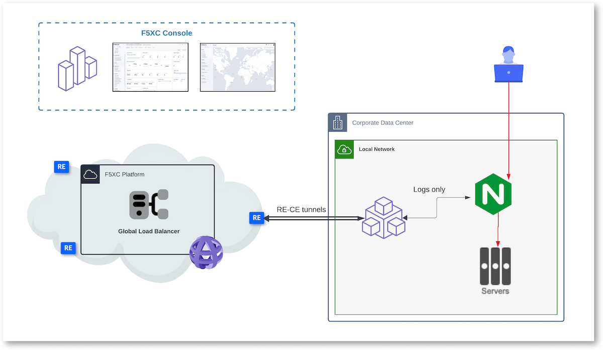
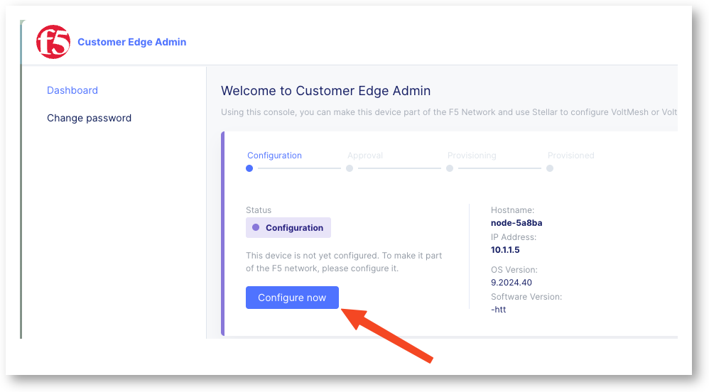
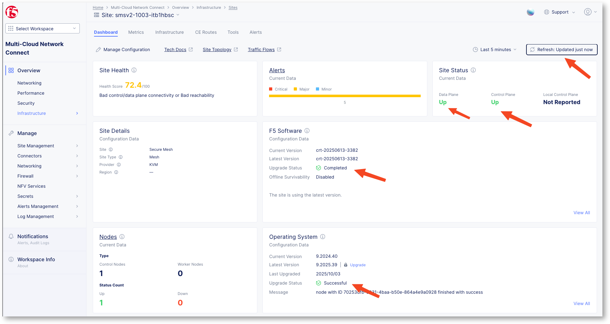
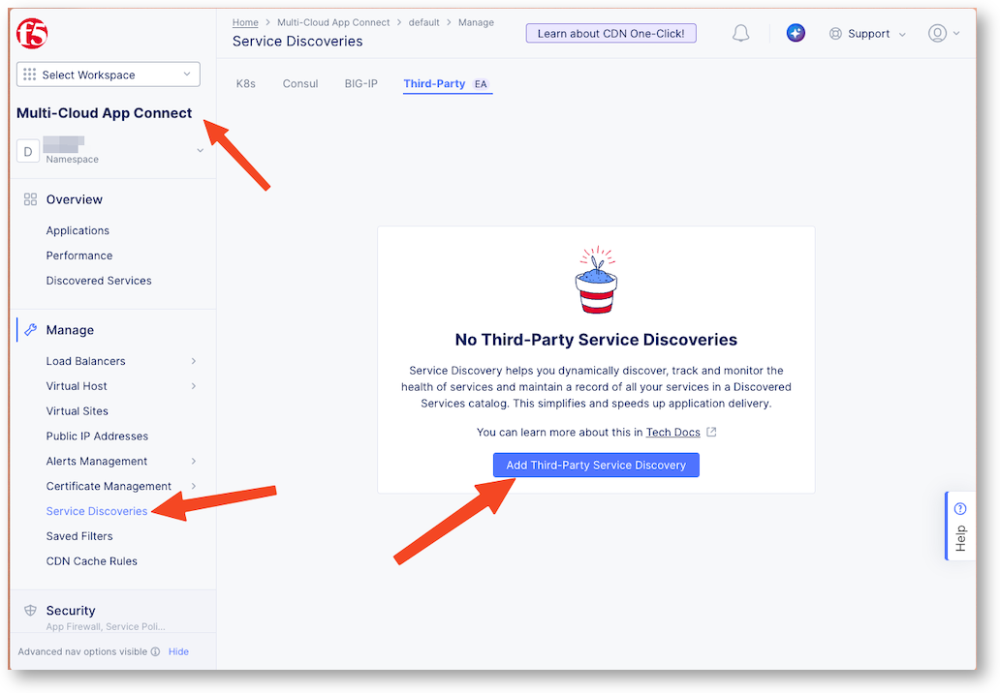
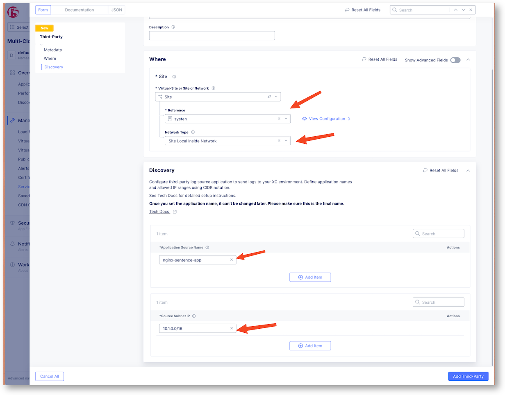
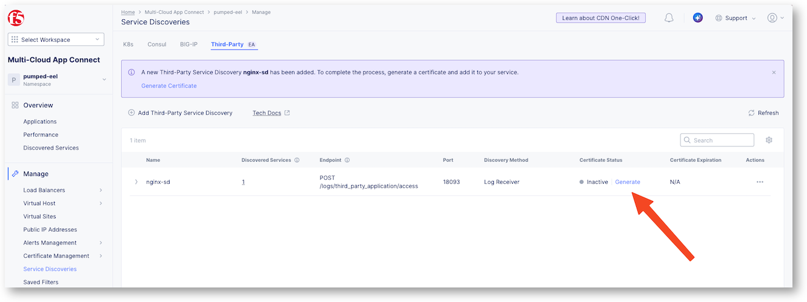

Enable API discovery for Nginx
==============================

In the previous lab, we learnt how F5 Distributed Cloud can discover API Endpoints on traffic handled by BIG-IP.

In this lab, you will replicate the same use case but with Nginx as a Dataplane instead of BIG-IP. You will learn how to ``onboard`` a Nginx into F5XC, in order to enable the API Discovery feature on this Nginx.

Key take aways before jumping into the lab:

* Out of Band Discovery
* CE required on Nginx Network
* CE collects and anonymises logs from Nginx
* F5XC runs API Discovery engine in F5XC infrastructure
* Outcomes

  * Inventory
  * Security Insights risks
  * Compliance
  * Authentication state
  * Sensitive Data

.. note:: If you have already run the lab 7 (API Discovery for BIG-IP), you can reuse the same CE and skip to the sections "Deploy and Register CE". If not, please follow the instructions below to deploy and register a new CE in order to connect your Nginx to F5XC.

Deploy and register Customer Edge (CE)
--------------------------------------

The CE (Customer Edge) is not yet registered. But it is already deployed in your UDF environment.
The CE is deployed with 2 NICs

* NIC Outside in charge of IPSEC tunnels between CE and RE
* NIC Inside in charge of configuring BIG-IP and collect logs from BIG-IP

.. note:: In a nutshell, F5XC will configure the BIG-IP to collect request logs from the Virtual Server, and send those logs to the CE. Then the CE will anonymize the logs and send them to the F5XC infrastructure to render the API Discovery endpoints and insights.

Register the CE
^^^^^^^^^^^^^^^

In UDF environment, connect to the Customer Edge (CE) UI with credentials below

* Creds : ``admin`` / ``Volterra123``
* Update credentials, you can reuse the same password ``Volterra123``
* Click on ``Configure Now`` button

* Token (copy paste using the copy button below)

.. code-block:: none

   $$smsv2Token$$

* Cluster Name: ``$$smsv2SiteName$$``
* Hostmane: ``master0``

* Click ``Save Configuration``

Wait 15min to see the CE registered in the F5 Distributed Cloud Console.

Check Registration on the F5 Distributed Cloud Console
^^^^^^^^^^^^^^^^^^^^^^^^^^^^^^^^^^^^^^^^^^^^^^^^^^^^^^

In F5 Distributed Cloud Console

* Go to Multi-Cloud Network Connect > Overview > Infrastructure > Sites
* Search for your site ``$$smsv2SiteName$$``
* Click on it
* Refresh the page till upgrades are finished and every flag is green

.. note:: Your CE is up and running and ready to connect to the BIG-IP in order to collect logs.

Onboard Nginx instance
----------------------

Onboard Nginx is different from onboarding a BIG-IP as Nginx is not natively integrated with F5XC like BIG-IP. This type of integration is called 3rd Party Proxy integration. 
Therefore, we will need to install a lightweight JS module on the Nginx to collect logs and send them to the CE.

The Nginx instance is already up and running in your UDF environment, but it is not yet onboarded to F5XC. To onboard it, you will need to connect to the Nginx instance and make some "changes".

Create the Service Discovery profile
^^^^^^^^^^^^^^^^^^^^^^^^^^^^^^^^^^^^

Create a new Service Discovery configuration for 3rd Parties Services

* Name : ``nginx-sd``
* Site : select your site name ``$$smsv2SiteName$$``
* Network type : ``Site Local Inside Network``

In the discovery section, create an application associated to the Nginx application

* Application Source Name : ``nginx-sentence-app``
* Source Subnet IP : ``10.1.0.0/16`` (this is the subnet used by the Nginx)

Download the certificates
^^^^^^^^^^^^^^^^^^^^^^^^^

* Click on Generate button to download the certificates that will be used by the JS module on the Nginx to send logs to the CE securely.

* Now, you must upload the zip file into the Nginx instance. 

  * In UDF portal, on the Nginx instance, there is a Access Method called ``UPLOAD CERTS``. Click on it, it will open a new browser page to an Upload file website.

    .. image:: ../pictures/3rd-udf-upload.png
       :align: left
       :scale: 50%

  * Upload your zip file from this website. It will be uploaded into the Nginx instance.

    .. image:: ../pictures/3rd-upload-site.png
       :align: left
       :scale: 70%

Enable API Disovery and Download the token
^^^^^^^^^^^^^^^^^^^^^^^^^^^^^^^^^^^^^^^^^^

* In Web Application and API Protection > Third-Party Applications, enable API Discovery for the application ``nginx-sd-nginx-sentence-app``

  .. image:: ../pictures/3rd-enable-apid.png
     :align: left

* Enable and select your API Definition (created in the previous labs)

  .. note:: If you have not done the previous labs, you can create the API Definition now by following the instructions in the lab 2 :ref:`swagger-lab`. Stop the lab when the Definition is created, and come back to this lab to select the API Definition and enable API Discovery.

:ref:`swagger-lab`

* Enable API Discovery
* Select also the Sensitive Data Detection Policy created in the previous labs, or keep the Default.
* Save

* Click on the 3-dots, and ``Generate Token``
* Copy and save the token, you will need it to configure the JS module on the Nginx

.. note:: You have finished the configuration on the F5 Distributed Cloud side, now you need to configure the JS module on the Nginx side to start sending logs to the CE and see API Discovery in action.

Configure the Nginx instance
----------------------------

.. note:: The Nginx instance is already pre-configured to avoid too many copy-paste between this lab guide and the SSH session. You will just adapt the configuration to collect the logs from Nginx application and forward the logs to the CE.

* SSH or WEBSSH to the Nginx instance

  .. image:: ../pictures/3rd-nginx-ssh.png
     :align: left
     :scale: 70%

Copy the certificats
^^^^^^^^^^^^^^^^^^^^

* Copy the certificates zip file into /home/ubuntu directory and unzup it

  .. code-block:: bash

     sudo cp /var/www/nginx-upload-file/uploads/<your-file-name>.zip /home/ubuntu/certs.zip
     unzip certs.zip

* Copy the certs and key files into the right directories, and modify the permissions. Those certs+key are use to initiate the MTLS between the Nginx and the CE.

  .. code-block:: bash

     sudo cp client.crt /etc/nginx/certs/client.crt
     sudo cp client.key /etc/nginx/certs/client.key
     sudo cp server_ca.crt /etc/nginx/certs/server_ca.crt

     sudo chmod 600 /etc/nginx/certs/client.key
     sudo chmod 644 /etc/nginx/certs/client.crt
     sudo chmod 644 /etc/nginx/certs/server_ca.crt

Update the nginx configuration
^^^^^^^^^^^^^^^^^^^^^^^^^^^^^^

* Modify the nginx.conf file

  .. code-block:: bash

     sudo nano /etc/nginx/nginx.conf

  .. note:: Have a look on the nginx.conf file, and check the blocks that are already configured for you. I added comments so you can understand them.

  .. note:: Block Upstream obelix -> this is the CE

  .. note:: Block Server 8080 -> website to upload the certificates

  .. note:: Block Server 80 -> the Nginx LB proxying the sentence application

  .. note:: Block Server 18080 -> the API Discovery configuration to collect the logs, format them, and send them to the CE.

* At the end of the file, ``uncomment`` those 5 lines. Ctrl+X to exit, Y to save and Enter to confirm.

  .. code-block:: bash

     proxy_ssl_certificate           /etc/nginx/certs/client.crt;
     proxy_ssl_certificate_key       /etc/nginx/certs/client.key;
     proxy_ssl_trusted_certificate   /etc/nginx/certs/server_ca.crt;
     proxy_ssl_verify                on;
     proxy_ssl_server_name   off;          # keep off unless Telemetry_Ingestion_Service cert CN matches host

* Reload nginx configuration

  .. code-block:: bash

     sudo nginx -s reload

Check your lab
--------------

From the Nginx instance
^^^^^^^^^^^^^^^^^^^^^^^

Now it is time to check if

* Nginx is proxying the sentence application
* Nginx is sending logs to the CE

To do so, we will simulate some traffic to the sentence application, and check if we can see the logs.

.. note:: A traffic generator script is running every 9 minutes. It is already running, you don't have to run it.

* Connect in SSH or WebSSH to the Nginx instance and run the command below, keep the terminal opened.

  .. code-block:: bash

     tail -f /var/log/nginx/location_debug.log

* Connect in SSH or WebSSH to the Traffic Gen instance. It opens a second terminal
* Run the command below

  .. code-block:: bash

     curl -k --location 'http://10.1.10.10/api/colors' --header 'Host: api.sentence.com'

* Now, look into the nginx instance terminal, you should see the logs being collected by the nginx and sent to the CE. Below the JSON in a pretty format:

  .. code-block:: json

     {
      "time": "2026-04-30T18:48:56+00:00",
      "server": "127.0.0.1",
      "uri": "/logs/third_party_application/access",
      "method": "POST",
      "status": 500,
      "token": "",
      "body": 
         {
            "method": "GET",
            "url": "http://api.sentence.com/api/colors",
            "client_ip": "10.1.10.6",
            "req_headers": {
               "host": "api.sentence.com",
               "user-agent": "curl/7.81.0",
               "accept": "*/*"
            },
            "request_timestamp": 1777574936841,
            "req_payload": "",
            "rsp_status": 200,
            "rsp_headers": {
               "content-type": "application/json; charset=utf-8",
               "content-length": "210",
               "x-powered-by": "Express",
               "vary": "Origin, Accept-Encoding",
               "access-control-allow-credentials": "true",
               "cache-control": "no-cache",
               "pragma": "no-cache",
               "expires": "-1",
               "x-content-type-options": "nosniff",
               "etag": "W/\"d2-RfZ0XwcFqRWrzPouuyCT4I7Dhlo\""
            },
            "response_timestamp": 1777574936841,
            "rsp_payload": "WwogIHsKICAgICJpZCI6IDEsCiAgICAibmFtZSI6ICJyZWQiCiAgfSwKICB7CiAgICAiaWQiOiAyLAogICAgIm5hbWUiOiAiYmx1ZSIKICB9LAogIHsKICAgICJpZCI6IDMsCiAgICAibmFtZSI6ICJncmVlbiIKICB9LAogIHsKICAgICJuYW1lIjogImJsYWNrIiwKICAgICJpZCI6IDQKICB9LAogIHsKICAgICJuYW1lIjogInllbGxvdyIsCiAgICAiaWQiOiA1CiAgfQpd",
            "req_id": "3bc650014be3462ebd99fc8d3f3dd06f",
            "dst": "10.1.20.7:31220",
            "rsp_code_details": "200"
         }
      }
    
.. note:: you can notice all the datas from the request and also the response is encoded in Base64. You can decode it with https://www.base64decode.org/

From the F5 Distributed Cloud Console
^^^^^^^^^^^^^^^^^^^^^^^^^^^^^^^^^^^^^

* Connect to the F5 Distributed Cloud Console, in the WAAP section, and click on the ``Third-Party Applications`` menu on the left
* Click on the application ``nginx-sd-nginx-sentence-app``

  .. image:: ../pictures/3rd-menu-apid.png
     :align: left

* After 2 hours, or if the trainer can run the job for you, you will find all the outcomes of the API Discovery, such as Inventory, Security Insights, Compliance, Authentication state, Sensitive Data, etc...

  .. image:: ../pictures/3rd-apid-outcomes.png
     :align: left

.. note:: Congrats, the lab is finished.