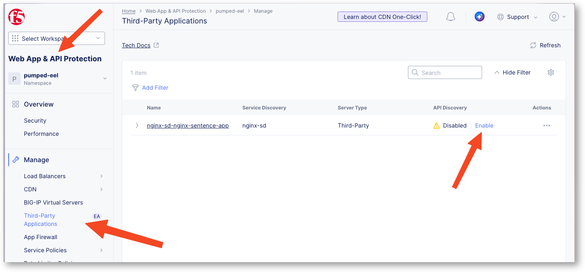

Enable API discovery for Nginx
==============================

In the previous lab, we learnt how F5 Distributed Cloud can discover API Endpoints on traffic handled by BIG-IP.

In this lab, you will replicate the same use case but with Nginx as a Dataplane instead of BIG-IP. You will learn how to ``onboard`` a Nginx into F5XC, in order to enable the API Discovery feature on this Nginx.

Key take aways before jumping into the lab:

* Out of Band Discovery
* CE required on Nginx Network
* CE collects and anonymises logs from Nginx
* F5XC runs API Discovery engine in F5XC infrastructure
* Outcomes

  * Inventory
  * Security Insights risks
  * Compliance
  * Authentication state
  * Sensitive Data

.. image:: ../pictures/nginx-apid-archi.png
   :align: left

.. note:: If you have already run the lab 7 (API Discovery for BIG-IP), you can reuse the same CE and skip to the sections "Deploy and Register CE". If not, please follow the instructions below to deploy and register a new CE in order to connect your Nginx to F5XC.

Deploy and register Customer Edge (CE)
--------------------------------------

The CE (Customer Edge) is not yet registered. But it is already deployed in your UDF environment.
The CE is deployed with 2 NICs

* NIC Outside in charge of IPSEC tunnels between CE and RE
* NIC Inside in charge of configuring BIG-IP and collect logs from BIG-IP

.. note:: In a nutshell, F5XC will configure the BIG-IP to collect request logs from the Virtual Server, and send those logs to the CE. Then the CE will anonymize the logs and send them to the F5XC infrastructure to render the API Discovery endpoints and insights.

Register the CE
^^^^^^^^^^^^^^^

In UDF environment, connect to the Customer Edge (CE) UI with credentials below

* Creds : ``admin`` / ``Volterra123``
* Update credentials, you can reuse the same password ``Volterra123``
* Click on ``Configure Now`` button

.. image:: ../pictures/configure-ce.png
   :align: left

* Token (copy paste using the copy button below)

.. code-block:: none

   $$smsv2Token$$

* Cluster Name: ``$$smsv2SiteName$$``
* Hostmane: ``master0``

* Click ``Save Configuration``

Wait 15min to see the CE registered in the F5 Distributed Cloud Console.

Check Registration on the F5 Distributed Cloud Console
^^^^^^^^^^^^^^^^^^^^^^^^^^^^^^^^^^^^^^^^^^^^^^^^^^^^^^

In F5 Distributed Cloud Console

* Go to Multi-Cloud Network Connect > Overview > Infrastructure > Sites
* Search for your site ``$$smsv2SiteName$$``
* Click on it
* Refresh the page till upgrades are finished and every flag is green

.. image:: ../pictures/site-view.png
   :align: left

.. note:: Your CE is up and running and ready to connect to the BIG-IP in order to collect logs.

Onboard Nginx instance
----------------------

Onboard Nginx is different from onboarding a BIG-IP as Nginx is not natively integrated with F5XC like BIG-IP. This type of integration is called 3rd Party Proxy integration. 
Therefore, we will need to install a lightweight JS module on the Nginx to collect logs and send them to the CE.

The Nginx instance is already up and running in your UDF environment, but it is not yet onboarded to F5XC. To onboard it, you will need to connect to the Nginx instance and make some "changes".

Create the Service Discovery profile
^^^^^^^^^^^^^^^^^^^^^^^^^^^^^^^^^^^^

Create a new Service Discovery configuration for 3rd Parties Services

.. image:: ../pictures/3rd-sd-page.png
   :align: left

* Name : ``nginx-sd``
* Site : select your site name ``$$smsv2SiteName$$``
* Network type : ``Site Local Inside Network``

In the discovery section, create an application associated to the Nginx application

* Application Source Name : ``nginx-sentence-app``
* Source Subnet IP : ``10.1.0.0/16`` (this is the subnet used by the Nginx)

.. image:: ../pictures/3rd-sd-config.png
   :align: left

Download the certificates
^^^^^^^^^^^^^^^^^^^^^^^^^

* Click on Generate button to download the certificates that will be used by the JS module on the Nginx to send logs to the CE securely.

.. image:: ../pictures/3rd-gen-cert.png
   :align: left

* Now, you must upload the zip file into the Nginx instance. Unfortunately, with UDF, this will require some preaparation. Please follow each step carefully

  * You need a terminal and scp tool on your laptop
  * Copy the FQDN of the Nginx instance

    * In UDF, click on ``Deployment`` tab, then find the ``Nginx`` instance, and click on ``Details``

      .. image:: ../pictures/3rd-access-button.png
         :align: left 

    * Click on the ``Access Methods`` tab, and find the SSH (not the Web Shell)
    * Copy the FQDN from the SSH command line (if you can't only select the FQDN, copy the full command and extract it from your Notepad for example)

      .. image:: ../pictures/3rd-access-fqdn.png
         :align: left 

  * Now from your terminal, use the scp command to copy the zip file to the Nginx instance

    .. code-block:: bash

       scp -O -P 47005 <certificate-zip-file> ubuntu@<FQDN-of-nginx-instance>:/home/ubuntu/
    
    .. note:: example -> scp -O -P 47005 pumped-eel.nginx-sd.certificates.zip ubuntu@04398a92-397f-4b70-acf8-54d6129bc80b.access.udf.f5.com:/home/ubuntu

Enable API Disovery and Download the token
^^^^^^^^^^^^^^^^^^^^^^^^^^^^^^^^^^^^^^^^^^

* In Web Application and API Protection > Third-Party Applications, enable API Discovery for the application ``nginx-sd-nginx-sentence-app``
* Enable and select your API Definition (created in the previous labs)
* Enable API Discovery

* Click on the 3-dots, and ``Generate Token``
* Copy and save the token, you will need it to configure the JS module on the Nginx

.. note:: You have finished the configuration on the F5 Distributed Cloud side, now you need to configure the JS module on the Nginx side to start sending logs to the CE and see API Discovery in action.

Configure the Nginx instance
^^^^^^^^^^^^^^^^^^^^^^^^^^^^

* SSH or WEBSSH to the Nginx instance
