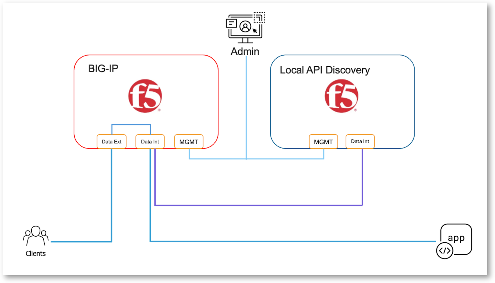
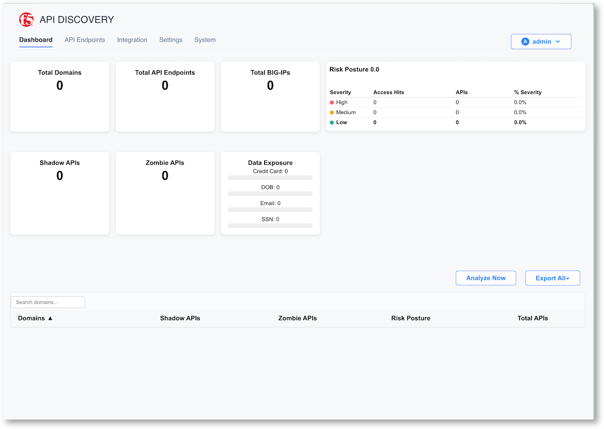

Install LAD server on Linux server
==================================

Local API Discovery, aka LAD, is a local server collecting logs from BIG-IP and delivering API Discovery locally. Compared to other F5 API Discovery solutions, LAD is fully local and air gapped.
It fits perfectly for environments where cloud storage or cloud connectivity is a challenge.

Simplified Architecture
-----------------------

The LAD Server acts as a syslog receiver collecting access/request logs from the BIG-IP. In this lab, it is a Ubuntu server with 2 interfaces

* NIC1 to BIG-IP mgmt network
* NIC2 to BIG-IP self-ip backend network

Run LAD installer
-----------------

* SSH or WebSSH to LAD Server machine
* Go to folder /home/ubuntu/LAD_RELEASE-v0.3.0
* Run the installer

  .. code-block:: bash

    ./install_local.sh

* Keep all settings by default - just click ``enter`` key
* Wait till the installer finishes !!!!

You will see the environment details

.. note:: 
  💡  Your environment is now accessible via the following links:
  Name        URL                    User           Password       Description
  ----        ---                    ----           --------       -----------
  Dashboard   https://localhost:8000 N/A            N/A            API Discovery Dashboard

  🌐  Usable IP addresses on this host: 10.1.1.9, 10.1.20.9, 172.17.0.1, 172.18.0.1

Connect to LAD Console
----------------------

* In UDF, in the LAD Server machine, select ``LAD UI``
* Connect with ``admin`` / ``admin``
* You are asked to change the password, change with ``F5twister$2026``
* Sign-In

