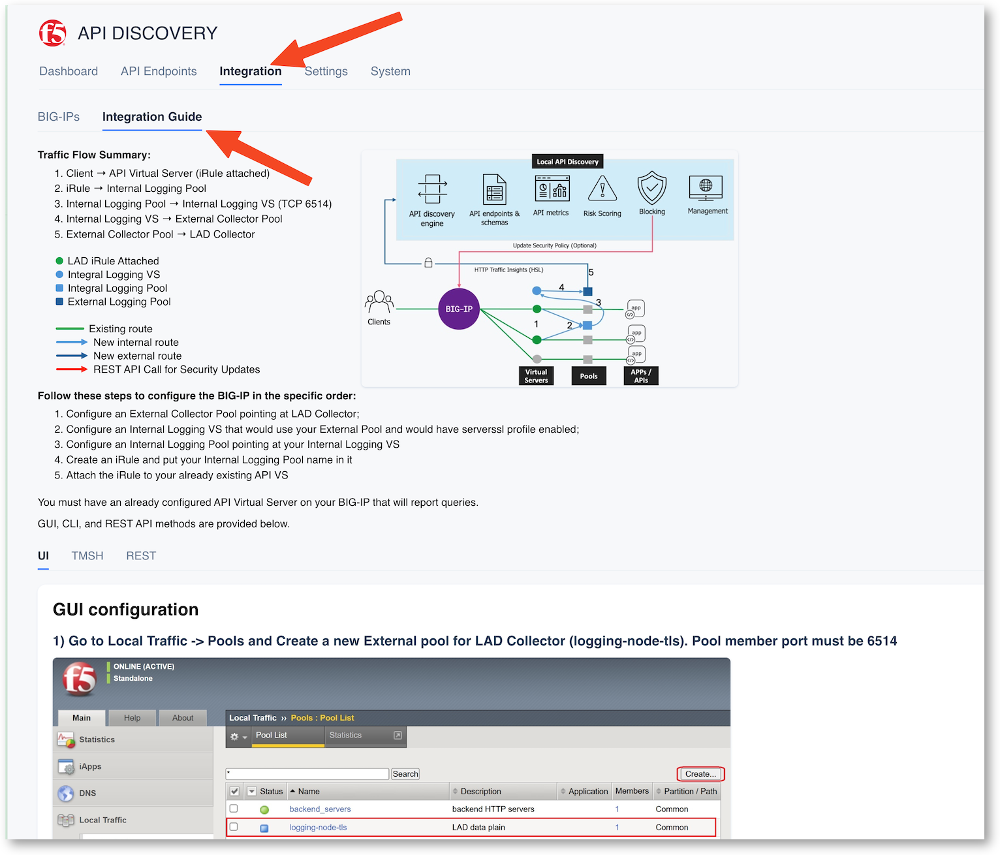
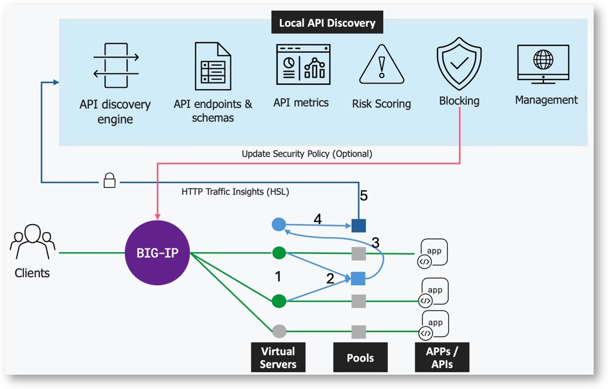
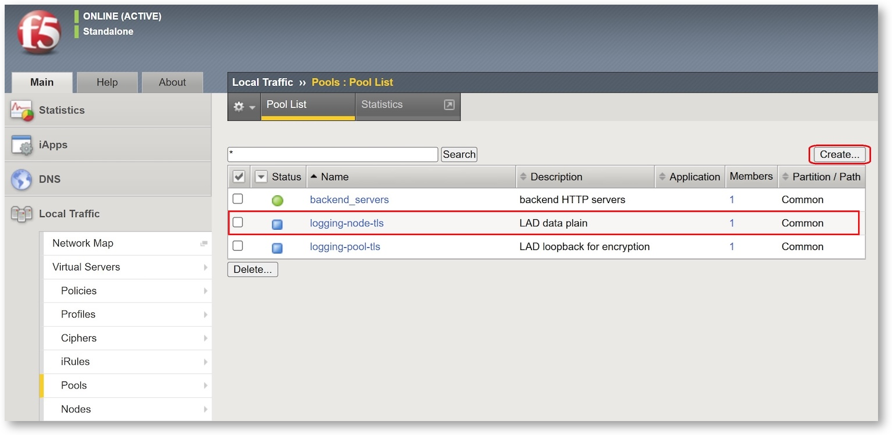
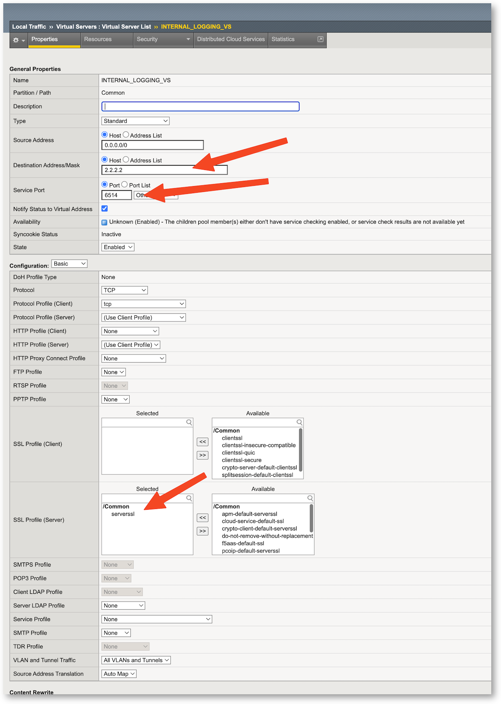
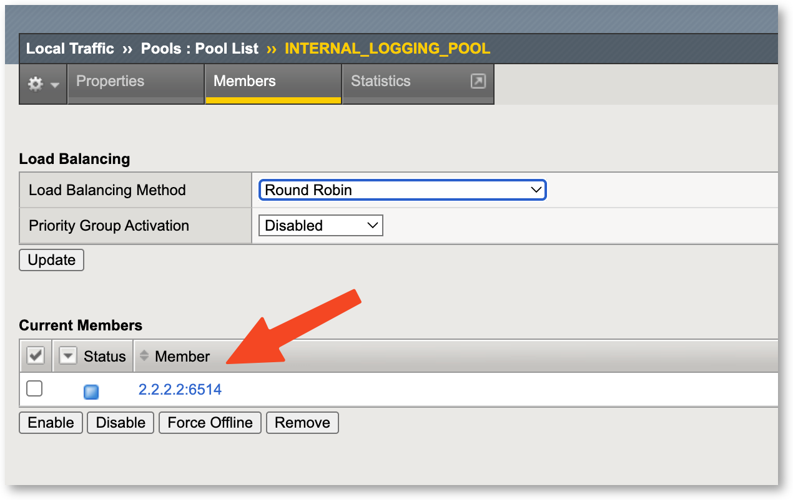
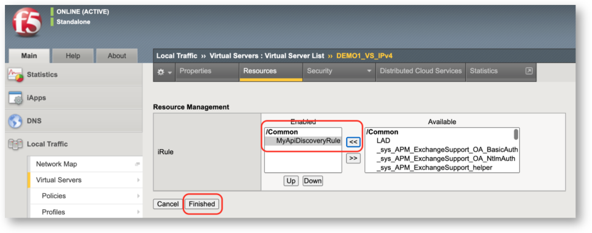

Configure BIG-IP for Local API Discovery
========================================

Now, we must configure the BIG-IP to collect the datas, format the datas, and send the datas to the LAD server.

There is a how-to into the LAD Console for TMUI, iControl REST and TMSH.

Click on ``Integration`` > ``Integration Guide``



You can see how it works and how it is interconnected.

In a nutshell, an irule attached to the API Application Virtual Server is collecting the requests and responses, formating the datas and send those datas to a pool where the LAD is a member.



Configure the BIG-IP via the TMUI
---------------------------------

Login to the BIGIP as ``admin`` / ``admin``

Configure the External Pool
^^^^^^^^^^^^^^^^^^^^^^^^^^^

This pool is used to send the datas to the LAD server

* Go to Local Traffic -> Pools and Create a new External pool for LAD Collector.
* Name (use this name): logging-node-tls 
* Member IP address is the LADT internal Self-IP : ``10.1.20.9``
* Pool member port must be ``6514``



Configure the Internal VS
^^^^^^^^^^^^^^^^^^^^^^^^^

* Configure a VS named ``syslog-tls-virtual`` 
* Destination Address : can be anything as it is internal. Let's put ``2.2.2.2``
* With service port ``6514`` 
* Server SSL Profile : ``serverssl``
* Pool : ``logging-node-tls`` (created in the previous step)



Configure the Internal Logging Pool
^^^^^^^^^^^^^^^^^^^^^^^^^^^^^^^^^^^

This Pool is used to target the Internal VS created previously. It will be called by the iRule we are going to create.

* Go to Local Traffic -> Pools and Create a new Internal pool
* Name (use this name) : ``logging-pool-tls``
* Member IP Address is the Internal VS IP. We set ``2.2.2.2``, so use this IP as a member
* Pool member port is ``6514``



Create the iRule and assign to the Internal VS
^^^^^^^^^^^^^^^^^^^^^^^^^^^^^^^^^^^^^^^^^^^^^^

* Go to Local Traffic -> iRules
* Create the iRules with the code below. Name the iRules ``MyApiDiscoveryRule```

.. note:: 

    Check that the Internal Pool name is ``logging-pool-tls``. This name is used into this iRule. If you have follow the below steps and used the same names as defined in the lab, the iRule is ready and can be copy/paste.

    .. image:: ../pictures/irule2.png
       :align: left

.. code-block:: bash

        #Created by F5ers Matt S. & Mike W.
    when RULE_INIT {
        # Debug flag - set to 0 to disable local logging
        set static::debug 1

        if {[catch {
            # Set sampling rate
            # Pre-compile regular expressions for better performance
            set static::timestamp_format "%Y-%m-%dT%T.000Z"
            set static::json_template "\"uri\":\"%s\",\"host\":\"%s\",\"method\":\"%s\",\"statusCode\":\"%s\""
            set static::sampling_rate 1
            set static::rate_limit 100
            set static::email_regex {[A-Za-z0-9._%+-]+@[A-Za-z0-9.-]+\.[A-Z|a-z]{2,}}
            set static::ssn_regex {(\d{3}-\d{2}-\d{4})}
            set static::cc_regex {(?:4[0-9]{12}(?:[0-9]{3})?|5[1-5][0-9]{14}|3[47][0-9]{13}|6(?:011|5[0-9]{2})[0-9]{12}|(?:2131|1800|35[0-9]{3})[0-9]{11})}
            set static::json_ssn_regex {"ssn":\s*"(\d{3}-\d{2}-\d{4})"}
            set static::json_dob_regex {"dob":\s*"(\d{4}-\d{2}-\d{2})"}
            set static::json_email_regex {"email":\s*"([^"]+@[^"]+)"}
            set static::dob_regex {(\d{4}-\d{2}-\d{2}|\d{2}/\d{2}/\d{4}|\d{2}-\d{2}-\d{4}|\d{2}\.\d{2}\.\d{4})}
            set static::valid_years_start 1900
            set static::valid_years_end 2099
            # Luhn check optimization - moved to static context
            set static::luhn_check {
                set sum 0
                set alternate 0
                set card_number [string map {" " ""} $card_number]

                for {set i [string length $card_number]} {$i > 0} {incr i -1} {
                    scan [string index $card_number [expr {$i - 1}]] %d digit
                    if {$alternate} {
                        set digit [expr {($digit * 2 > 9) ? ($digit * 2 - 9) : ($digit * 2)}]
                    }
                    incr sum $digit
                    set alternate [expr {!$alternate}]
                }
                expr {$sum % 10 == 0}
            }
        } err]} {
            log local0.error "Error in RULE_INIT: $err"
        }

        if {$static::debug} {
            log local0. "API Discovery iRule initialized with debug logging enabled"
        }
    }

    when CLIENT_ACCEPTED {
        if {[catch {
            set processRequest 0
            set z1_logging logging-pool-tls
            set z1_remoteLogProtocol TCP
            set hsl [HSL::open -proto $z1_remoteLogProtocol -pool $z1_logging]
        } err]} {
            log local0.error "Error in CLIENT_ACCEPTED: $err"
            return
        }
    }

    when HTTP_REQUEST {
        if {[catch {
            set processRequest 0
        ## Check if count table exists. If not, initalize with 1 to avoid null errors. Auto-reset count after 180 seconds to keep the table small. 
            if {[table lookup -notouch "request_counter"] < 1} {
                table set "request_counter" 1 180 180
            } else {
            ## Table exists. Increment request count. 
                set current_count [table incr -notouch "request_counter"]
            }
            # Determine if this request should be processed
            if {[expr {[table lookup -notouch "request_counter"] % $static::sampling_rate == 0}]} {
                set processRequest 1 
                if {$static::debug} {
                    log local0. "Processing request (counter=[table lookup -notouch "request_counter"])"
                }
                # Initialize variables once
                array set z1_request_data {
                    sensitive_in_payload false
                    sensitive_in_headers false
                    sensitive_data_types {}
                    payload_type "Unknown"
                    has_auth false
                    xff ""
                    clientsslprofile "none"
                    req_content_type ""
                }

                if {[catch {
                    # Store non-header HTTP request data
                    set z1_request_data(http_uri) [HTTP::uri]
                    set z1_request_data(http_host) [HTTP::host]
                    set z1_request_data(http_method) [HTTP::method]
                    set z1_request_data(http_version) [HTTP::version]
                    set z1_request_data(client_ip) [IP::client_addr]
                    set z1_request_data(client_port) [TCP::client_port]
                    set z1_request_data(virtual_server) [virtual name]

                    # Per-host rate limiting (100 req/sec)
                    set z1_global_counter 0
                    set rl_host $z1_request_data(http_host)
                    set now_sec [clock seconds]
                    # Track per-second request count for this host
                    set rate_key "z1:rate:$rl_host:$now_sec"
                    if {[table lookup -notouch $rate_key] eq ""} {
                        table set $rate_key 0 2 2
                    }
                    set current_rate [table incr $rate_key]

                    # Use a per-host-per-second counter for suppressed logs
                    set ex_key_current "z1:ex:$rl_host:$now_sec"

                    # Decide whether to allow per-request log or accumulate
                    if {$current_rate <= $static::rate_limit} {
                        set z1_rate_allow 1
                        # Elect a single "first allowed" request for this host in the current second (atomic via incr)
                        set first_key "z1:first:$rl_host:$now_sec"
                        set first_count [table incr $first_key]
                        # Ensure the marker expires quickly
                        table set $first_key $first_count 2 2
                        if {$first_count == 1} {
                            # Drain suppressed logs from the previous second only
                            set prev_sec [expr {$now_sec - 1}]
                            set prev_key "z1:ex:$rl_host:$prev_sec"
                            set pending_excess [table lookup -notouch $prev_key]
                            if {$pending_excess ne "" && $pending_excess > 0} {
                                set z1_global_counter $pending_excess
                                table delete $prev_key
                            } else {
                                set z1_global_counter 0
                            }
                        } else {
                            set z1_global_counter 0
                        }
                    } else {
                        set z1_rate_allow 0
                        # Accumulate suppressed count for this host in the current second
                        if {[table lookup -notouch $ex_key_current] eq ""} {
                            table set $ex_key_current 0 3 3
                        }
                        table incr $ex_key_current
                    }

                    # Initialize card_number for proper scope
                    set card_number ""

                    # Process all headers in a single pass
                    foreach header_name [HTTP::header names] {
                        set header_value [HTTP::header $header_name]

                        # Handle specific headers directly
                        switch -exact -- $header_name {
                            "Content-Type" { set z1_request_data(req_content_type) $header_value }
                            "Referer" { set z1_request_data(http_referrer) $header_value }
                            "User-Agent" { set z1_request_data(http_user_agent) $header_value }
                            "Authorization" { set z1_request_data(has_auth) true }
                            "X-Forwarded-For" {
                                set xff_ips [split $header_value ","]
                                set z1_request_data(xff) [string trim [lindex $xff_ips end]]
                            }
                        }

                        # Process for sensitive data
                        # SSN Check with date format exclusion
                        if {[regexp $static::ssn_regex $header_value -> ssn]} {
                            scan $ssn {%d-%d-%d} d1 d2 d3
                            if {$d1 >= 1 && $d1 <= 12} {
                                if {$static::debug} {
                                    log local0. "Skipping SSN check for date-like pattern in header"
                                }
                            } else {
                            # Validate SSN
                                if {$d1 >= 1 && $d1 <= 899 && $d1 != 666 && 
                                    $d2 >= 1 && $d2 <= 99 && 
                                    $d3 >= 1 && $d3 <= 9999} {
                                    lappend z1_request_data(sensitive_data_types) "SSN"
                                    set z1_request_data(sensitive_in_headers) true
                                }
                            }
                        }

                        # Credit card check with optimized Luhn
                        if {[regexp $static::cc_regex $header_value cc_number]} {
                            set card_number $cc_number
                            if {[eval $static::luhn_check]} {
                                lappend z1_request_data(sensitive_data_types) "CreditCard"
                                set z1_request_data(sensitive_in_headers) true
                            }
                        }

                        # Email check
                        if {[regexp $static::email_regex $header_value]} {
                            lappend z1_request_data(sensitive_data_types) "Email"
                            set z1_request_data(sensitive_in_headers) true
                        }

                        # DOB check with multiple format support
                        if {[regexp $static::dob_regex $header_value dob]} {
                            if {[catch {
                                switch -regexp $dob {
                                    {\d{4}-\d{2}-\d{2}} {
                                        scan $dob {%d-%d-%d} year month day
                                    }
                                    {\d{2}/\d{2}/\d{4}} {
                                        scan $dob {%d/%d/%d} month day year
                                    }
                                    {\d{2}-\d{2}-\d{4}} {
                                        scan $dob {%d-%d-%d} month day year
                                    }
                                    {\d{2}\.\d{2}\.\d{4}} {
                                        scan $dob {%d.%d.%d} month day year
                                    }
                                }

                                if {$month >= 1 && $month <= 12 && 
                                    $day >= 1 && $day <= 31 && 
                                    $year >= $static::valid_years_start && 
                                    $year <= $static::valid_years_end} {
                                    lappend z1_request_data(sensitive_data_types) "DOB"
                                    set z1_request_data(sensitive_in_headers) true
                                }
                            } err]} {
                                log local0.error "Error processing DOB: $err"
                            }
                        }
                    }
                } err]} {
                    log local0.error "Error collecting request data: $err"
                }

                # Collect payload if present
                if {[HTTP::header "Content-Length"] ne ""} {
                    if {[catch {
                        set z1_req_length [HTTP::header "Content-Length"]
                        if {[string is integer -strict $z1_req_length] && $z1_req_length > 0} {
                            HTTP::collect $z1_req_length
                        }
                    } err]} {
                        log local0.error "Error collecting payload: $err"
                    }
                }
            }
        } err]} {
            log local0.error "Error in HTTP_REQUEST: $err"
        }
    }

    when HTTP_REQUEST_DATA {
        if { $processRequest == 0} { return }

        if {[catch {
            if {[HTTP::payload length] > 0} {
                set z1_payload [HTTP::payload]

                # Determine payload type efficiently
                if {[catch {
                    if {$z1_request_data(http_version) eq "2.0" && $z1_request_data(req_content_type) eq "application/grpc"} {
                        set z1_request_data(payload_type) "gRPC"
                    } else {
                        set trimmed_payload [string trimleft $z1_payload]
                        set first_char [string index $trimmed_payload 0]

                        switch -exact -- $first_char {
                            "\[" { set z1_request_data(payload_type) "REST_ARRAY" }
                            "\{" { set z1_request_data(payload_type) "REST" }
                            "<" {
                                if {[string first "<soap" $z1_payload] != -1} {
                                    set z1_request_data(payload_type) "SOAP"
                                } elseif {[string first "<?xml" $z1_payload] == 0} {
                                    set z1_request_data(payload_type) "XML"
                                }
                            }
                        }
                    }
                } err]} {
                    log local0.error "Error determining payload type: $err"
                }

                # Process all patterns in a single pass
                if {[catch {
                    # Define all patterns and their validation rules
                    set pattern_list [list \
                        $static::ssn_regex "SSN" "validate_ssn" \
                        $static::cc_regex "CreditCard" "validate_cc" \
                        $static::email_regex "Email" "" \
                        $static::dob_regex "DOB" "validate_dob"]

                    # Process each pattern once through the payload
                    foreach {pattern type validation} $pattern_list {
                        switch $type {
                            "SSN" {
                                if {[regexp $pattern $z1_payload -> ssn]} {
                                    scan $ssn {%d-%d-%d} d1 d2 d3
                                    if {$d1 >= 1 && $d1 <= 899 && $d1 != 666 &&
                                        $d2 >= 1 && $d2 <= 99 &&
                                        $d3 >= 1 && $d3 <= 9999} {
                                        lappend z1_request_data(sensitive_data_types) $type
                                        set z1_request_data(sensitive_in_payload) true
                                    }
                                }
                            }
                            "CreditCard" {
                                if {[regexp $pattern $z1_payload cc_number]} {
                                    set card_number $cc_number
                                    if {[eval $static::luhn_check]} {
                                        lappend z1_request_data(sensitive_data_types) $type
                                        set z1_request_data(sensitive_in_payload) true
                                    }
                                }
                            }
                            "Email" {
                                if {[regexp $pattern $z1_payload]} {
                                    lappend z1_request_data(sensitive_data_types) $type
                                    set z1_request_data(sensitive_in_payload) true
                                }
                            }
                            "DOB" {
                                if {[regexp $pattern $z1_payload dob]} {
                                    switch -regexp $dob {
                                        {\d{4}-\d{2}-\d{2}} {
                                            scan $dob {%d-%d-%d} year month day
                                        }
                                        {\d{2}/\d{2}/\d{4}} {
                                            scan $dob {%d/%d/%d} month day year
                                        }
                                        {\d{2}-\d{2}-\d{4}} {
                                            scan $dob {%d-%d-%d} month day year
                                        }
                                        {\d{2}\.\d{2}\.\d{4}} {
                                            scan $dob {%d.%d.%d} month day year
                                        }
                                    }

                                    if {$month >= 1 && $month <= 12 && 
                                        $day >= 1 && $day <= 31 && 
                                        $year >= $static::valid_years_start && 
                                        $year <= $static::valid_years_end} {
                                        lappend z1_request_data(sensitive_data_types) $type
                                        set z1_request_data(sensitive_in_payload) true
                                    }
                                }
                            }
                        }
                    }
                } err]} {
                    log local0.error "Error processing patterns in payload: $err"
                }

                # Type-specific processing
                if {[catch {
                    switch -- $z1_request_data(payload_type) {
                        "REST" - "REST_ARRAY" {
                            foreach {pattern type} [list \
                                $static::json_ssn_regex "SSN" \
                                $static::json_dob_regex "DOB" \
                                $static::json_email_regex "Email"] {
                                if {[regexp $pattern $z1_payload]} {
                                    if {[lsearch $z1_request_data(sensitive_data_types) $type] == -1} {
                                        lappend z1_request_data(sensitive_data_types) $type
                                        set z1_request_data(sensitive_in_payload) true
                                    }
                                }
                            }
                        }

                        "XML" - "SOAP" {
                            if {[regexp {<[^>]+>([^<]+)} $z1_payload -> content]} {
                                foreach {pattern type} [list \
                                    $static::ssn_regex "SSN" \
                                    $static::email_regex "Email" \
                                    $static::dob_regex "DOB"] {
                                    if {[regexp $pattern $content]} {
                                        if {[lsearch $z1_request_data(sensitive_data_types) $type] == -1} {
                                            lappend z1_request_data(sensitive_data_types) $type
                                            set z1_request_data(sensitive_in_payload) true
                                        }
                                    }
                                }
                            }
                        }
                    }
                } err]} {
                    log local0.error "Error processing payload type-specific patterns: $err"
                }
            }
        } err]} {
            log local0.error "Error in HTTP_REQUEST_DATA: $err"
        }
    }

    ## Exit gracefully if this request is not marked for processing.
    when LB_SELECTED {
            if { $processRequest == 0} { return }

        if {[catch {
            set z1_request_data(pool) [LB::server]
            if {$static::debug} {
                log local0. "Selected pool member: $z1_request_data(pool)"
            }
        } err]} {
            log local0.error "Error in LB_SELECTED: $err"
        }
    }

    ## Exit gracefully if this request is not marked for processing.
    when HTTP_RESPONSE {
        if { $processRequest == 0} { return }
        if {[info exists z1_rate_allow] && $z1_rate_allow == 0} { return }
        # Store all HTTP response data immediately to avoid timing issues
        if {[catch {
            set http_status [HTTP::status]
            set res_content_type [HTTP::header "Content-Type"]
            set res_content_length [expr {[HTTP::header "Content-Length"] ne "" ? [HTTP::header "Content-Length"] : 0}]

            if {$static::debug} {
                log local0. "Processing HTTP response with status: $http_status"
            }
            # Build response headers JSON efficiently
            if {[catch {
                set header_parts [list]
                foreach header_name [HTTP::header names] {
                    if {$header_name ne "Content-Type"} {
                        set header_value [HTTP::header $header_name]
                        lappend header_parts "\"$header_name\":\"[URI::encode $header_value]\""
                    }
                }
                set response_headers "\{[join $header_parts ,]\}"
            } err]} {
                log local0.error "Error processing response headers: $err"
            }
            # Generate RFC 5424 compliant syslog message efficiently
            if {[catch {
                set timestamp [clock format [clock seconds] -format $static::timestamp_format -gmt true]
                set types [join $z1_request_data(sensitive_data_types) ","]
                # Properly format the sensitive data types
                if {$static::debug} {
                    log local0. "Preparing final message with [llength $z1_request_data(sensitive_data_types)] sensitive data types"
                }
                set msg_base [format $static::json_template $z1_request_data(http_uri) $z1_request_data(http_host) $z1_request_data(http_method) $http_status]
                # Build message parts list with previously stored data
                set msg_parts [list]
                lappend msg_parts "\"uri\":\"$z1_request_data(http_uri)\""
                lappend msg_parts "\"host\":\"$z1_request_data(http_host)\""
                lappend msg_parts "\"method\":\"$z1_request_data(http_method)\""
                lappend msg_parts "\"statusCode\":\"$http_status\""
                lappend msg_parts "\"xff\":\"$z1_request_data(xff)\""
                set reqCType [expr {[info exists z1_request_data(req_content_type)] ? $z1_request_data(req_content_type) : ""}]
                lappend msg_parts "\"reqCType\":\"$reqCType\""
                lappend msg_parts "\"resCType\":\"$res_content_type\""
                lappend msg_parts "\"httpv\":\"$z1_request_data(http_version)\""
                lappend msg_parts "\"hasAuthorization\":$z1_request_data(has_auth)"
                lappend msg_parts "\"sensitiveInHeaders\":$z1_request_data(sensitive_in_headers)"
                lappend msg_parts "\"sensitiveDataTypes\":\"$types\""
                lappend msg_parts "\"sensitiveInPayload\":$z1_request_data(sensitive_in_payload)"
                lappend msg_parts "\"payloadType\":\"$z1_request_data(payload_type)\""
                lappend msg_parts "\"vs_name\":\"$z1_request_data(virtual_server)\""
                lappend msg_parts "\"globalCounter\":$z1_global_counter"
                # Construct the final message with proper JSON formatting
                set msg_json "\{[join $msg_parts ,]\}"
                set final_message "<118>1 $timestamp [info hostname] F5-API-Discovery - - - $msg_json\n"

                if {$static::debug} {
                    log local0. "Sending HSL message: $msg_json"
                }
                ## Send HSL log 
                if {[catch {
                    HSL::send $hsl $final_message
                } err]} {
                    log local0.error "Error sending HSL message: $err"
                }
            } err]} {
                log local0.error "Error preparing message: $err"
            }

            if {$static::debug} {
                log local0. "Request processing completed"
            }

            if {[catch {
                unset -nocomplain -- msg_parts msg_json final_message timestamp types header_parts
                unset -nocomplain -- http_status res_content_type res_content_length response_headers
                array unset z1_request_data
                array unset z1_response_data
                unset -nocomplain -- z1_payload
            } err]} {
                log local0.error "Error cleaning up variables: $err"
            }
        } err]} {
            log local0.error "Error in HTTP_RESPONSE: $err"
        }
    }

Attach the iRule to the Internal VS
^^^^^^^^^^^^^^^^^^^^^^^^^^^^^^^^^^^

* Edit the Internal VS and attach the iRule on it



* SAVE

.. note::

    The BIG-IP is ready to receive traffic, and send API traffic datas to the LAD Server.