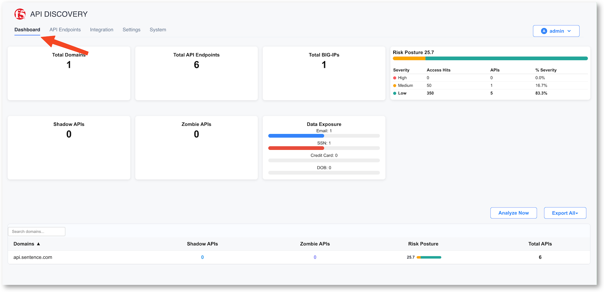
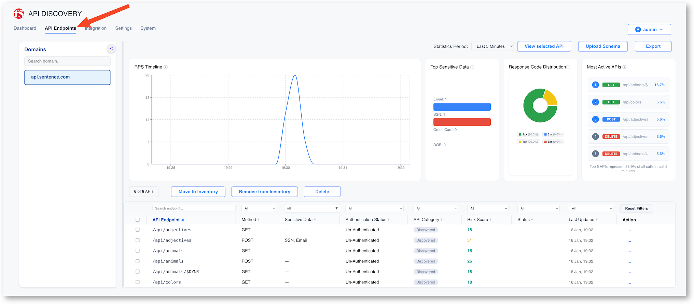
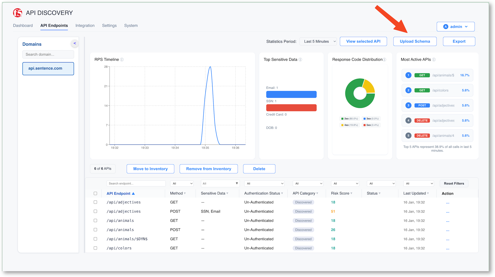
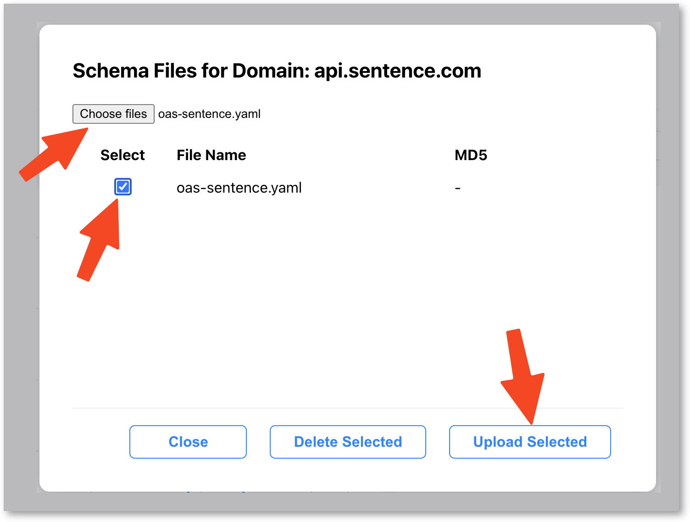
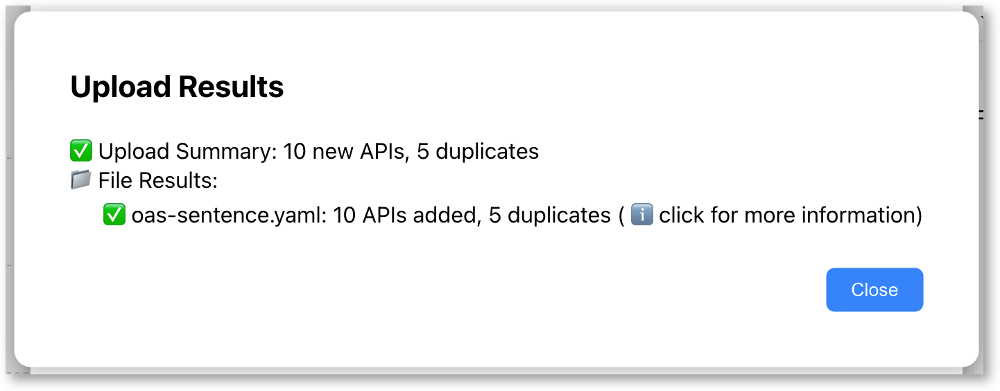
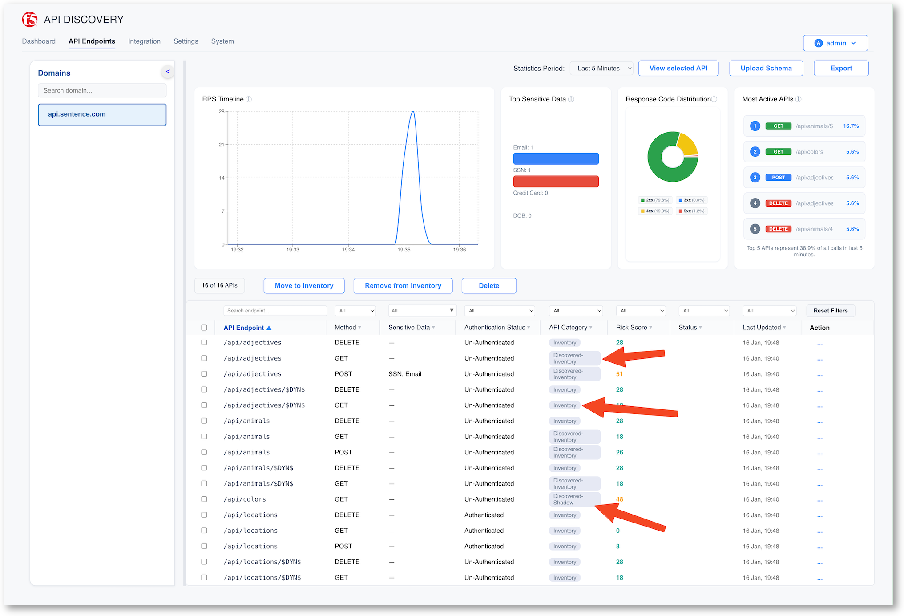

See API Discovery outcomes and block shadow APIs
================================================

After 2-3 minutes, you can start seeing insights into the LAD Console.

Check what the console can display
----------------------------------

* Click on the Dashboard menu and check the insights
* You an see 1 domain and several endpoints

* Click on API Endpoints and check the insights
* You can see for each disovered endpoints

  * PATH
  * Method
  * Sensitive data
  * Authentication (if used)
  * Category (Discovered, Shadow, Inventory)
  * Risk score - you can click on it to get more details
  * Status

Import the OpenAPI spec file for this app
-----------------------------------------

This applications called ``sentence app`` displays a sentence with several words. You can learn more here : https://github.com/f5devcentral/sentence-demo-app
On purpose, for this lab, one endpoint will not be part of the OAS Spec file. It is the ``/colors`` endpoint.

The OAS spec file is below.

* Copy the OAS spec file below and save it on your laptop as ``oas-sentence.yaml``

.. code-block:: YAML

        openapi: 3.0.1
    info:
    title: API Sentence Generator
    description: list of attributes
    version: v1-auth
    paths:
    /api/adjectives:
        get:
        description: List all adjectives
        operationId: listAdjectives
        tags:
            - adjectives
        responses:
            '200':
            description: a list of adjectives with their index
            content:
                application/json:
                schema:
                    $ref: "#/components/schemas/Adjectives"
                #examples: {"adjectives": [{"id":1,"name":"blue"}]}
        post:
        description: create an adjective
        operationId: createAdjective
        tags:
            - adjectives
        requestBody:
            content:
            application/json:
                schema:
                type: object
                properties:
                    name:
                    type: string
                    id:
                    type: integer
                examples:
                '0':
                    value: '{"name":"calm"}'
                '1':
                    value: '{"id":2}'
        responses:
            '201':
            description: adjective created
            content:
                application/json; charset=utf-8:
                schema:
                    type: string
                examples: {}
        delete:
        description: delete an adjective
        operationId: deleteAdjective
        tags:
            - adjectives
        responses:
            '200':
            description: Delete an Adjective
            content:
                application/json; charset=utf-8:
                schema:
                    type: string
                examples: {}
    /api/adjectives/{id}:
        get:
        description: get a specific adjective
        operationId: showAdjectiveById
        tags:
            - adjectives
        parameters:
            - name: id
            in: path
            required: true
            description: id of the adjective to retrieve
            schema:
                type: integer
        responses:
            '200':
            description: Successful
            content:
                application/json; charset=utf-8:
                schema:
                    $ref: "#/components/schemas/Adjective"
                # examples: {"adjectives": [{"id":1,"name":"blue"}]}
        delete:
        description: delete an adjective
        tags:
            - adjectives
        parameters:
            - name: id
            in: path
            required: true
            description: id of the adjective to retrieve
            schema:
                type: integer
        responses:
            '200':
            description: Delete an Adjective
            content:
                application/json; charset=utf-8:
                schema:
                    type: string
                examples: {}
    /api/animals:
        get:
        description: List all animals
        operationId: listAnimals
        tags:
            - animals
        responses:
            '200':
            description: a list of animals with their index
            content:
                application/json:
                schema:
                    $ref: "#/components/schemas/Animals"
                #examples: {"animals": [{"id":1,"name":"lion"}]}
        post:
        description: create an animal
        operationId: createAnimal
        tags:
            - animals
        requestBody:
            content:
            application/json:
                schema:
                type: object
                properties:
                    name:
                    type: string
                    id:
                    type: integer
                examples:
                '0':
                    value: '{"name":"cat"}'
                '1':
                    value: '{"id":2}'
        responses:
            '201':
            description: animal created
            content:
                application/json; charset=utf-8:
                schema:
                    type: string
                examples: {}
        delete:
        description: delete an adjective
        operationId: deleteAnimal
        tags:
            - animals
        responses:
            '200':
            description: Delete an Adjective
            content:
                application/json; charset=utf-8:
                schema:
                    type: string
                examples: {}
    /api/animals/{id}:
        get:
        description: get a specific adjective
        operationId: showAnimalsById
        tags:
            - animals
        parameters:
            - name: id
            in: path
            required: true
            description: id of the animal to retrieve
            schema:
                type: integer
        responses:
            '200':
            description: Successful
            content:
                application/json; charset=utf-8:
                schema:
                    $ref: "#/components/schemas/Animal"
                # examples: {"adjectives": [{"id":1,"name":"lion"}]}
        delete:
        description: delete an adjective
        tags:
            - animals
        parameters:
            - name: id
            in: path
            required: true
            description: id of the animal to retrieve
            schema:
                type: integer
        responses:
            '200':
            description: Delete an Adjective
            content:
                application/json; charset=utf-8:
                schema:
                    type: string
                examples: {}
    /api/locations:
        get:
        description: List all locations
        operationId: listlocations
        security: 
            - bearerAuth: []
        tags:
            - locations
        responses:
            '200':
            description: a list of locations with their index
            content:
                application/json:
                schema:
                    $ref: "#/components/schemas/Locations"
                #examples: {"animals": [{"id":1,"name":"mountain"}]}
        post:
        description: create a location
        operationId: createLocation
        security: 
            - bearerAuth: []
        tags:
            - locations
        requestBody:
            content:
            application/json:
                schema:
                type: object
                properties:
                    name:
                    type: string
                    id:
                    type: integer
                examples:
                '0':
                    value: '{"name":"lake"}'
        responses:
            '201':
            description: location created
            content:
                application/json; charset=utf-8:
                schema:
                    type: string
                examples: {}
        delete:
        description: delete a location
        operationId: deleteLocation
        security: 
            - bearerAuth: []
        tags:
            - locations
        responses:
            '200':
            description: Delete a Location
            content:
                application/json; charset=utf-8:
                schema:
                    type: string
                examples: {}
    /api/locations/{id}:
        get:
        description: get a specific location
        operationId: showLocationById
        tags:
            - locations
        parameters:
            - name: id
            in: path
            required: true
            description: id of the location to retrieve
            schema:
                type: integer
        responses:
            '200':
            description: Successful
            content:
                application/json; charset=utf-8:
                schema:
                    $ref: "#/components/schemas/Location"
                # examples: {"locations": [{"id":1,"name":"mountain"}]}
        delete:
        description: delete a location
        tags:
            - locations
        parameters:
            - name: id
            in: path
            required: true
            description: id of the location to retrieve
            schema:
                type: integer
        responses:
            '200':
            description: Delete a Location
            content:
                application/json; charset=utf-8:
                schema:
                    type: string
                examples: {}

    components:
    schemas:
        Adjective:
        required:
            - id
            - name
        properties:
            id:
            type: integer
            format: int64
            name:
            type: string
    #      tag:
    #        type: string
        Adjectives:
        type: array
        items:
            $ref: "#/components/schemas/Adjective"
            
        Animal:
        required:
            - id
            - name
        properties:
            id:
            type: integer
            format: int64
            name:
            type: string
    #      tag:
    #        type: string
        Animals:
        type: array
        items:
            $ref: "#/components/schemas/Animal"
            

        Location:
        required:
            - id
            - name
        properties:
            id:
            type: integer
            format: int64
            name:
            type: string
    #      tag:
    #        type: string
        Locations:
        type: array
        items:
            $ref: "#/components/schemas/Location"
    securitySchemes:
        bearerAuth:
        type: http
        scheme: bearer
        bearerFormat: JWT
    servers:
    - url: http://api.sentence.com/api

* Click on ``Upload Schema``

* Choose Choose File and upload your ``oas-sentence.yaml`` file.
* Warning : You must select the file, and then click ``Upload Selected``

* You will see a summary. Close the windows and get back to the API Endpoint screen

* Now, you can see the full insights categorized

  * Inventory : endpoints from the OAS spec file
  * Discovered-Inventory : endpoints consumed (discovered) and also part of the OAS spec file
  * Discovered-Shadow : endpoints consumed (discovered) and NOT part of the OAS spec file

