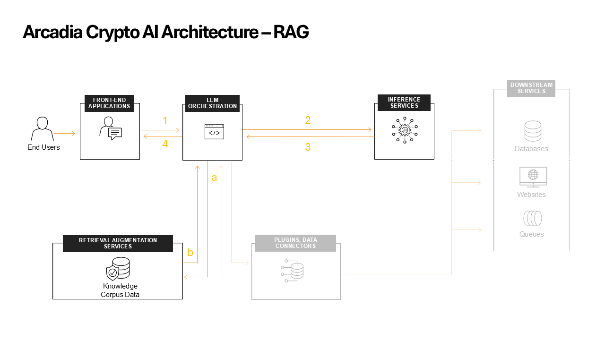

Inline implementation
#####################

The first implementation method we are going to explore is **inline**.

1. **User** sends question to **AI Orchestrator**
2. **LLM Orchestrator** queries the **RAG** with the user prompt to get **contextual data**
3. **RAG** responds with up to 5 chunks of **contextual data**
4. **LLM Orchestrator** combines the **prompt + contextual data** and sends it to the **LLM** 
5. **LLM** returns response to **LLM Orchestrator**
6. **LLM Orchestrator** sends the **LLM** response back to the **user**

When using RAG systems, we can enhance the overall knowledge of the LLM with specific information.