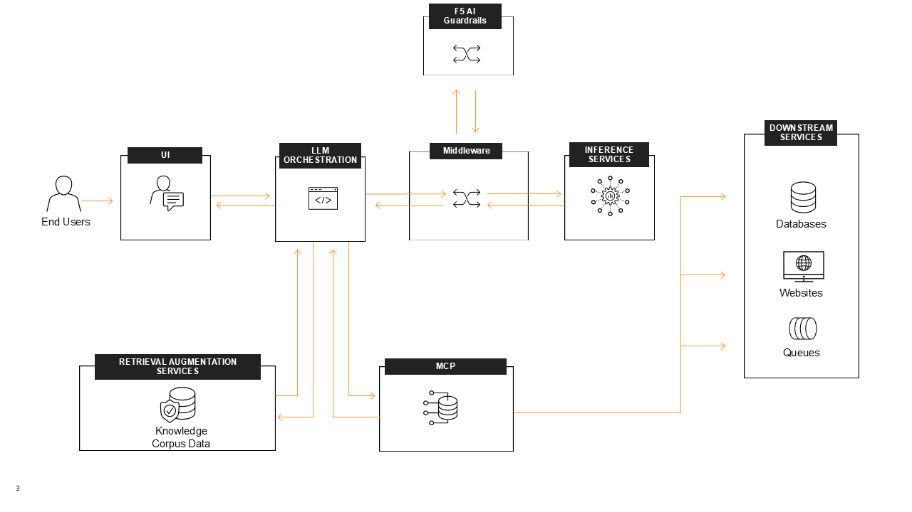

F5 AI Guardrails insertion
##########################

In order to insert **F5 AI Guardrails** in the protection process of our application we will use the **Out-of-Band** architecture.

This architecture requires modifying the **Orchestrator** code we will simplify it by using a middleware that will demonstrate the concept.

Important to note this middleware is community created and not supported by **F5**. It can be used for demos, POCs for quick testing or addopted by the customer.

The repository can be found here :ext_link:`https://github.com/sorinboia/f5_ai_guardrails_connector_nginx`.

**Traffic Flow**

1. User send prompt to the orchestrator.

2. The orchestrator sends the full context to the **Middleware**.

3. The **Middleware** will extract relevant data from the full context and send it to **F5 AI Guardrails** for scanning.

4. **F5 AI Guardrails** responds to the **Middleware** after scaning the data with a verdict allow/block/redact.

5. The **Middleware** will block or redact if needed otherwise the request with the full context will be forwarded to the **LLM**.
   
6. The **LLM** sends back the response to the orchestrator through the **Middleware**.

7. The **Middleware** will extract relevant response data and send it to **F5 AI Guardrails** for scanning.

8. **F5 AI Guardrails** responds to the orchestrator after scaning the LLM response with a verdict allow/block/redact.

9. The **Middleware** will block or redact if needed otherwise the response will be forwarded to the **Orchestrator**.

10. The orchestrator sends the LLM response back to the client

