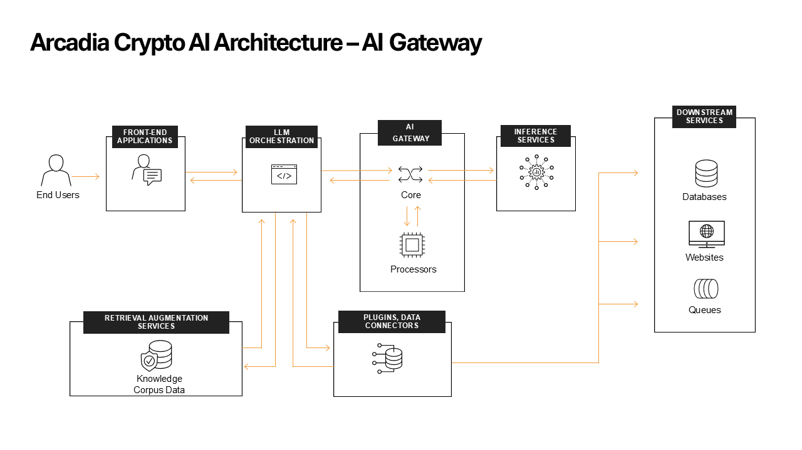

Inserting AI Gateway in the traffic flow
########################################

Now that we have an understanding of what AI Gateway let's explore how AIGW is deployed in our environment and how it is integrated with the Arcadia Crypto application.

1. From now on the configuration we will do is from the Jumphost bash, to access it go to **Access** under **Jumphost** -> **Web Shell** and change to the **ubuntu** user.

   .. code-block:: console

     su ubuntu
     
2. AIGW has been deployed using helm in the **AIGW** namespace.

   .. code-block:: console

     ubuntu@ubuntu:~$ kubectl get pods -n aigw
     NAME                                                 READY   STATUS    RESTARTS   AGE
     aigw-ui-66cb6cb9b9-ddh79                             1/1     Running   0          39m
     aigw-processor-labs-data-security-7c8bb7bf88-dsvgd   1/1     Running   0          20m
     aigw-processor-labs-prompt-guard-78f69dcc66-knckl    1/1     Running   0          20m
     aigw-77db7898c7-rt7sx                                1/1     Running   0          20m
     aigw-processors-f5-64d58f5487-cg8xp                  1/1     Running   0          2m15s
     minio-deployment-68f57dbd5-5ld4j                     1/1     Running   0          88s

   **aigw-77db7898c7-rt7sx** is the core container.

   **aigw-processors-f5-64d58f5487-cg8xp** is one of the processors containers.

   **aigw-processor-labs-data-security-7c8bb7bf88-dsvgd** is one of the processors containers.

   **aigw-processor-labs-prompt-guard-78f69dcc66-knckl** is one of the processors containers.

3. These are the helm initial values used to deploy the AI Gateway:

   .. code-block:: yaml

      ubuntu@ubuntu:~$ helm get values aigw
      USER-SUPPLIED VALUES:
      aigw:
        env:
        - name: AWS_ACCESS_KEY_ID
          value: minioadmin
        - name: AWS_REGION
          value: us-west-2
        - name: AWS_SECRET_ACCESS_KEY
          value: minioadmin
        - name: AWS_ENDPOINT_URL
          value: http://minio-data.aigw.svc.cluster.local:9000
        exporter:
          enabled: true
          s3Bucket: aigw
          s3UsePathStyle: true
          type: s3
        image:
          tag: v1.1.0
        service:
          port: 4141
          type: NodePort
      config:
        contents: |+
          server:
            address: ':4141'
            tls:
              enabled: false
            mtls:
              enabled: false
          routes:
            - schema: v1/chat_completions
              path: /api/chat
              policy: ollama
              timeoutSeconds: 500
          policies:
            - profiles:
                - name: ollama
              name: ollama
          profiles:
            - services:
                - name: ollama
              name: ollama

          services:
            - executor: ollama
              config:
                endpoint: http://34.216.15.125:11434/api/chat
              name: ollama
              type: llama3.1:8b

        name: aigw
      imagePullSecrets:
      - name: f5-registry-secret
      processorLabs:
        dataSecurity:
          enabled: true
          image:
            tag: v0.0.1
        promptGuard:
          enabled: true
          image:
            tag: v0.0.1
      processors:
        f5:
          image:
            tag: v1.1.0

4. The **LLM Orchestrator** is sending the traffic to the core container within the K8s cluster.

   .. code-block:: console
      
     ubuntu@ubuntu:~$ kubectl  get svc aigw -n aigw
     NAME   TYPE       CLUSTER-IP     EXTERNAL-IP   PORT(S)          AGE
     aigw   NodePort   172.17.0.149   <none>        4141:30941/TCP   79d

   .. code-block:: console
       
     ubuntu@ubuntu:~$ kubectl  get deployment -n arcadiacrypto arcadia-ai -ojson | jq .spec.template.spec.containers[0].env
     [
       {
         "name": "LLM",
         "value": "aigw.aigw.svc.cluster.local:4141"
       },
       {
         "name": "STOCKTAPIHOST",
         "value": "arcadia-stock-transaction"
       },
       {
         "name": "LLMMODEL",
         "value": "none"
       }
     ]

5. In order to see access logs that pass through the AIGW click on **Access** under **MicroK8s** -> **AIGW Experimmental UI** -> **Monitor** -> **Access** -> **Fetch Logs**
   
   This is **not part of the official product and should be treated as an opensource project in terms of support**.

6. In the next parts of the lab we will demonstrate how an LLM can be attacked and how we can protect it with AIGW.

   The AIGW configs will not be shown directly in the lab guide since they might change over time but they can be observed in the Jumphost bash.

   For each step we will provide the relevant helm command and the path to the config file.
