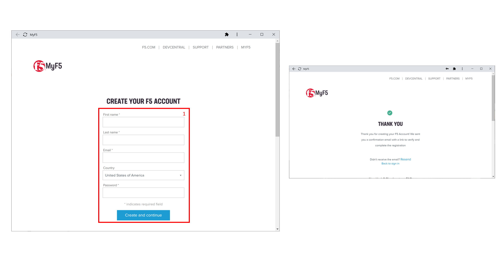
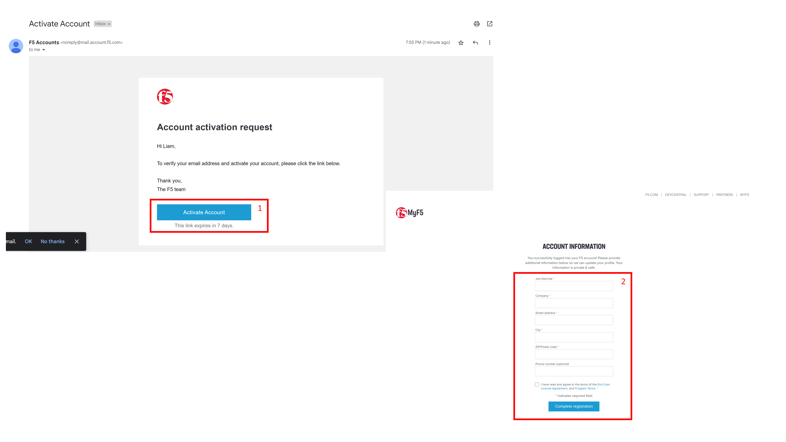

F5 Account Creation
###################

Creating an **F5 account** before attending the **F5 XC Workshop** is mandatory.

This needs to be a **personal account** and not a shared one. If you already have one you can skip the account creation.

The steps bellow describe how to create a new F5 account.

If you have any **issues** please contact you workshop host.

1. Go to the the **F5 account registration page** ( :ext_link:`https://account.f5.com/myf5/signin/register/` ) and fill in the requested information

2. After finishing the previous step you should have received an email requesting account activation. Check you **email inbox** and click the activation link, provide the account information and complete the registration

3. By now you should have been able to create and verify your F5 account.