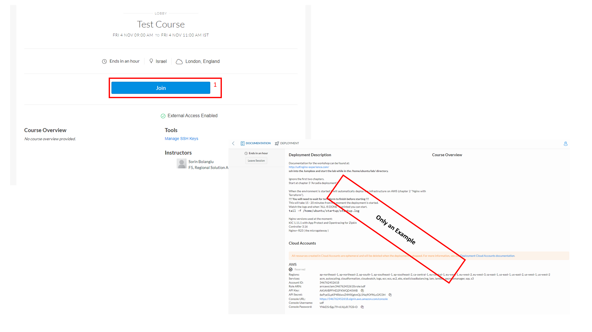

Accessing the UDF environment
#############################

Unified Demonstration Framework or in short UDF is a tool developed and maintained by the F5 UDF Team for creating reusable, maintainable, and shareable environments of F5 products. Its main purpose is to facilitate collaboration and the sharing of knowledge among subject-matter experts and allow others to easily benefit from that knowledge.

UDF is how we are going to access our workshop environment.

1. You should have recevied an **email from UDF** with instructions on how to access the course.

   Click the marked linked and follow the steps to login with your F5 Account

.. image:: ../pictures/Slide3.png
   :align: center

2. After loging in click the **“Join”** button and you are done.

  Further instructions are specific to each experience and will be provided by your host or explained in the Experiences section

3. By now you should have been able to create and verify your F5 account.